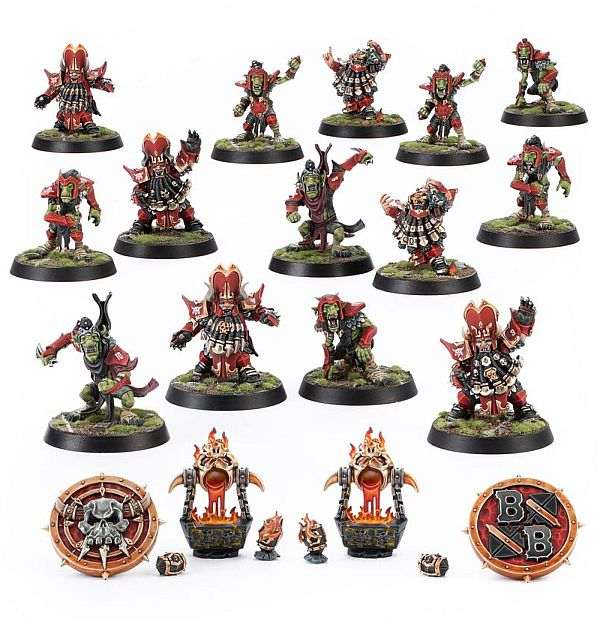

**TIER 1**

### Positionals

| Qty  | Position                | MA | ST | AG | PA | AV  | Skills                                                                                                   | Primary | Secondary | Cost |
| ---- | ------------------------ | -- | -- | -- | --- | --- | -------------------------------------------------------------------------------------------------------- | ------- | --------- | ---- |
| 0‑16 | Hobgoblin Lineman        | 6  | 3  | 3+ | 4+  | 8+  |                                                                                                          | G       | A S       | 40K  |
| 0‑2  | Hobgoblin Sneaky Stabba  | 6  | 3  | 3+ | 5+  | 8+  | • [Shadowing]   • [Stab]                                                                            | G       | A S       | 70K  |
| 0‑4  | Chaos Dwarf Blocker      | 4  | 3  | 4+ | 6+  | 10+ | • [Block]   • [Iron Hard Skin]   • [Thick Skull]                                               | G S     | A M       | 70K  |
| 0‑2  | Chaos Dwarf Flamesmith   | 5  | 3  | 4+ | 6+  | 10+ | • [Brawler]   • [Breathe Fire]   • [Disturbing Presence]   • [Thick Skull]                | G S     | A M       | 80K  |
| 0‑2  | Bull Centaur Blitzer     | 6  | 4  | 4+ | 6+  | 10+ | • [Sprint]   • [Sure Feet]   • [Thick Skull]                                                   | G S     | A M       | 130K |
| 0‑1  | Minotaur                 | 5  | 5  | 4+ | —   | 9+  | • [Frenzy]   • [Horns]   • [Loner] (4+)   • [Mighty Blow] (+1)   • [Thick Skull]   • [Unchannelled Fury] | S       | A G M     | 150K |

### Special Rules

* [Badlands Brawl]
* [Favoured of Hashut][Favoured Of..]

### Staff

* [Cheerleader] - 10K
* [Assistant Coach] - 10K
* [Re-roll] - 70K
* [Apothecary]  - 50K

### Starplayers

* [Akhorne The Squirrel] - 80K
* [Bomber Dribblesnot] - 50K
* [Fungus the Loon] - 80K
* [Glart Smashrip] - 195K
* [Grak and Crumbleberry] - 250K
* [Grashnak Blackhoof] - 240K
* [H'thark the Unstoppable] - 300K
* [Hakflem Skuttlespike] - 210K
* [Helmut Wulf] - 140K
* [Kreek 'the Verminator' Rustgouger] - 170K
* [Lord Borak the Despoiler] - 260K
* [Morg 'n' Thorg] - 380K
* [Nobbla Blackwart] - 120K
* [Rashnak Backstabber] - 130K
* [Ripper Bolgrot] - 250K
* [Scrappa Sorehead] - 130K
* [Skitter Stab-Stab] - 150K
* [The Black Gobbo] - 225K
* [Varag Ghoul-Chewer] - 280K
* [Withergrasp Doubledrool] - 170K
* [Zzharg Madeye] - 130K

### Inducements

* [Part-time Assistant Coaches] - 20K
* [Temp Agency Cheerleaders] - 20K
* [Unlimited Mercenary Player] - 30K
* [Weather mage] - 30K
* [Bloodweiser Kegs] - 50K
* [Bribe] - 100K
* [Extra Team Training] - 100K
* [Josef Bugman] - 100K
* [Special Plays] - 100K
* [Wandering Apothecary] - 100K
* [Biased Referee] - 120K
* [Hireling Sports-Wizard] (Wizard) - 150K

### New Inducements

* [Cavorting Nurglings] - 30K
* [Stunty Superstar] (Specialized Mercenary) - 30K
* [Team Mascot] - 30K
* [Dwarfen Runesmith] - 50K
* [Kari Coldsteel] - 50K
* [Legendary Lineman] (Specialized Mercenary) - 50K
* [Waaagh! Drummer] - 50K
* [Medicinal Unguent] - 60K
* [Brutal Blocker] (Specialized Mercenary) - 70K
* [Reliable Ringer] (Specialized Mercenary) - 70K
* [Horatio X. Schottenheim] - 80K
* [Mungo Spinecracker] - 80K
* [Papa Skullbones] - 80K
* [The Trundlefoot Triplets] (Biased Referee) - 80K
* [Fink da Fixer] - 90K
* [Schielund Scharlitan] - 90K
* [Ayleen Andar] - 100K
* [Jorm the Ogre] (Biased Referee) - 120K
* [Thoron Korensson] (Biased Referee) - 120K
* [Bona Fide Big Guy] (Specialized Mercenary) - 130K
* [Chaos Sorcerer] (Wizard) - 150K
* [Druchii Sports Sorceress] (Wizard) - 150K
* [Horticulturalist of Nurgle] (Wizard) - 150K
* [Night Goblin Shaman] (Wizard) - 150K
* [Ogre Firebelly] (Wizard) - 150K
* [Giant Mercenary] - 350K