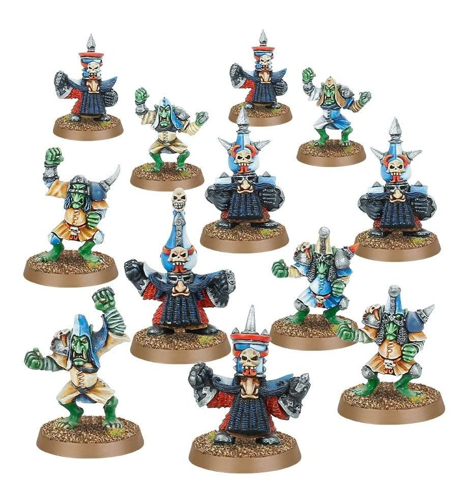

**TIER 1**

### Positionals

| Qty  | Position                         | M | S | AG | P  | AR  | Skills                                                                                                  | Primary | Secondary | Cost |
| ---- | -------------------------------- | - | - | -- | -- | --- | ------------------------------------------------------------------------------------------------------- | ------- | --------- | ---- |
| 0-16 | Hobgoblin Lineman                | 6 | 3 | 3+ | 4+ | 8+  |                                                                                                         | G       | A S       | 40K  |
| 0-6  | Chaos Dwarf Blocker | 4 | 3 | 4+ | 6+ | 10+ | • [Block]   • [Tackle]   • [Thick Skull]                                                         | G S      | A M     | 70K  |
| 0-2  | Bull Centaur Blitzer             | 6 | 4 | 4+ | 6+ | 10+ | • [Sprint]   • [Sure Feet]   • [Thick Skull]                                                              | G S      | A       | 130K |
| 0-1  | Enslaved Minotaur                | 5 | 5 | 4+ | -  | 9+  | • [Animal Savagery]   • [Frenzy]   • [Horns]   • [Loner] (4+)   • [Mighty Blow] (+1)   • [Thick Skull] | S       | A G M     | 150K |

### Special Rules

* [Badlands Brawl]
* [Worlds Edge Superleague]

Choose either:

* [Favoured of Nurgle][Favoured Of..]
* [Favoured of Khorne][Favoured Of..]
* [Favoured of Chaos Undivided][Favoured Of..]
* [Favoured of Slaanesh][Favoured Of..]
* [Favoured of Tzeentch][Favoured Of..]

### Staff

* [Cheerleader] - 10K
* [Assistant Coach] - 10K
* [Re-roll] - 70K
* [Apothecary]  - 50K

### Starplayers

* [Akhorne The Squirrel]         
* [Barik Farblast]               
* [Bilerot Vomitflesh]           
* [Bomber Dribblesnot]           
* [Fungus the Loon]              
* [Glart Smashrip]               
* [Grak and Crumbleberry]        
* [Grashnak Blackhoof]           
* [Grim Ironjaw]                 
* [Grombrindal, The White Dwarf] 
* [Hakflem Skuttlespike]         
* [Helmut Wulf]                  
* [Kreek Rustgouger]             
* [Lord Borak]                   
* [Max Spleenripper]             
* [Morg'n Thorg]   
* [Nobbla Blackwart]             
* [Ripper Blogrot]               
* [Rumbelow Sheepskin]           
* [Scrappa Sorehead]             
* [Scyla Anfingrimm]             
* [Skrull Halfheight]            
* [The Black Gobbo]              
* [Varag Ghoul-Chewer]           
* [Withergrasp Doubledrool]                    

### Inducements

* [Temp Agency Cheerleaders] - 20K
* [Part-time Assistant Coaches] - 20K
* [Weather mage] - 30K
* [Minus superstar] (Specialized Mercenary) - 30K
* [Cavorting Nurglings] - 30K
* [Team Mascot] - 30K
* [Unlimited Mercenary Player] - 30K
* [Bloodweiser Kegs] - 50K
* [Legendary Lineman] (Specialized Mercenary) - 50K
* [Brutal Blocker] (Specialized Mercenary) - 50K
* [[Pogo Stick]] - 50K
* [Chain and Ball] + [Secret Weapon] + [No Hands] + 3F -2M - [Dodge] - 60K
* [[Chainsaw]] + [Secret Weapon] + [No Hands] - [Dodge] - 40K
* [Medicinal Unguent] - 60K
* [Safe Provider] (Specialized Mercenary) - 70K
* [Waaagh]! Drummer - 50K
* [Kari Coldsteel] - 50K
* [Dwarfen Runesmith] - 50K
* [Extra Team Training] - 100K
* [Bribe] - 100K
* [Wandering Apothecary] - 100K
* [Plague Doctor] - 100K
* [Josef Bugman] - 100K
* [Ayleen Andar] - 100K
* [Special Plays] - 100K
* [Guaranteed Big Guy] (Specialized Mercenary) - 130K
* [Chaos Sorcerer] (Wizard) - 150K
* [Hireling Sports-Wizard] (Wizard) - 150K
* [Biased Referee] - 120K
* [Jorm the Ogre] (Biased Referee) - 120K
* [THoron Korensson] (Biased Referee) - 120K
* [Horatio X]. Schottenheim - 150K
* [Ogre Firebelly] (Wizard) - 150K
