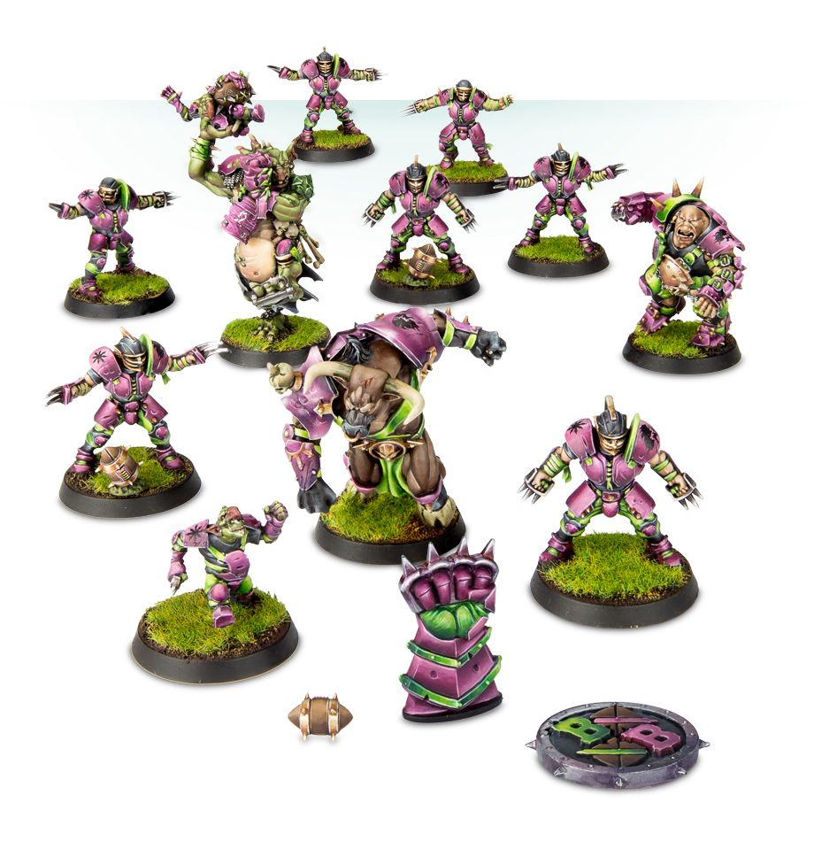

# Chaos Renegades

### Positionals

| Qty  | Position               | M | S | AG | P  | AR  | Skills                                                                                                                                                       | Primary | Secondary | Cost |
| ---- | ---------------------- | - | - | -- | -- | --- | ------------------------------------------------------------------------------------------------------------------------------------------------------------ | ------- | --------- | ---- |
| 0-12 | Renegade Human Lineman | 6 | 3 | 3+ | 4+ | 9+  |                                                                                                                                                              | G M    | A S       | 50K  |
| 0-1  | Renegade Human Thrower | 6 | 3 | 3+ | 3+ | 9+  | [Animosity] (All)  [Pass]   Safe Pair of Hands                                                                                                     | G M P   | A S       | 75K  |
| 0-1  | Renegade Goblin        | 6 | 2 | 3+ | 4+ | 8+  | [Animosity] (All)  [Dodge]   [Right Stuff]   [Stunty]                                                                                         | A M    | G P       | 40K  |
| 0-1  | Renegade Orc           | 5 | 3 | 3+ | 5+ | 10+ | [Animosity] (All)                                                                                                                                            | G M    | A S       | 50K  |
| 0-1  | Renegade Skaven        | 7 | 3 | 3+ | 4+ | 8+  | [Animosity] (All)                                                                                                                                            | G M    | A S       | 50K  |
| 0-1  | Renegade Dark Elf      | 6 | 3 | 2+ | 3+ | 9+  | [Animosity] (All)                                                                                                                                            | A G M   | P S       | 75K  |
| 0-1  | Renegade Troll\*       | 4 | 5 | 5+ | 5+ | 10+ | [Always Hungry]  [Loner] (4+)   [Mighty Blow] (+1)   [Projectile Vomit]   [Really Stupid]   [Regeneration]   [Throw Team-mate] | S       | A G M     | 115K |
| 0-1  | Renegade Ogre\*        | 5 | 5 | 4+ | 5+ | 10+ | [Bone Head]  [Loner] (4+)   [Mighty Blow] (+1)   [Thick Skull]   [Throw Team-mate]                                                         | S       | A G M     | 140K |
| 0-1  | Renegade Minotaur\*    | 5 | 5 | 4+ | -  | 9+  | [Frenzy]  [Horns]   [Loner] (4+)   [Mighty Blow] (+1)   [Thick Skull]   [Unchannelled Fury]                                         | S       | A G M     | 150K |
| 0-1  | Renegade Rat Ogre\*    | 6 | 5 | 4+ | -  | 9+  | [Animal Savagery]  [Frenzy]   [Loner] (4+)   [Mighty Blow] (+1)   [Prehensile Tail]                                                        | S       | A G M     | 150K |

\* A Chaos Renegades team may include up to three Big Guys.

### Special Rules

Choose either:

* [Favoured of Nurgle][Favoured Of..]
* [Favoured of Khorne][Favoured Of..]
* [Favoured of Chaos Undivided][Favoured Of..]
* [Favoured of Slaanesh][Favoured Of..]
* [Favoured of Tzeentch][Favoured Of..]

### Staff

* [Cheerleader] - 10K
* [Assistant Coach] - 10K
* [Reroll] - 70K
* [Apothecary]  - 50K

### Starplayers

* [Akhorne The Squirrel]
* [Max Spleenripper]
* [Helmut Wulf]
* [Kreek Rustgouger]
* [Withergrasp Doubledrool]
* [Bilerot Vomitflesh]
* [Glart Smashrip]
* [Scyla Anfingrimm]
* [Hakflem Skuttlespike]
* [Grashnak Blackhoof]
* [Grak and Crumbleberry]
* [Lord Borak]
* [Morg'n Thorg]

### Inducements

* [Temp Agency Cheerleaders] - 20K
* [Part-time Assistant Coaches] - 20K
* [Weather mage] - 30K
* [Minus superstar] (Specialized Mercenary) - 30K
* [Cavorting Nurglings] - 30K
* [Team Mascot] - 30K
* [No limit mercenary] - 30K
* [Bloodweiser Kegs] - 50K
* [Legendary Lineman] (Specialized Mercenary) - 50K
* [Brutal Blocker] (Specialized Mercenary) - 50K
* [Medicinal Unguent] - 60K
* [Safe Provider] (Specialized Mercenary) - 70K
* [The trundlefoot triplets] (Biased Referee) - 80K
* [Papa Skullbones] - 80K
* [Ayleen Andar] - 100K
* [Special Plays] - 100K
* [Extra training] - 100K
* [Bribe] - 100K
* [Wandering Apothecary] - 100K
* [Plague Doctor] - 100K
* [Josef Bugman] - 100K
* [Schielund Scharlitan] - 90K
* [Guaranteed Big Guy] (Specialized Mercenary) - 130K
* [Chaos Sorcerer] (Wizard) - 150K
* [Hireling Sports-Wizard] (Wizard) - 150K
* [Druchii Sports Sorceress] (Wizard) - 150K
* [Horticulturalist of Nurgle] (Wizard) - 150K
* [Halfling Master Chef] - 300K
* [Mercenary Giant] - 350K
