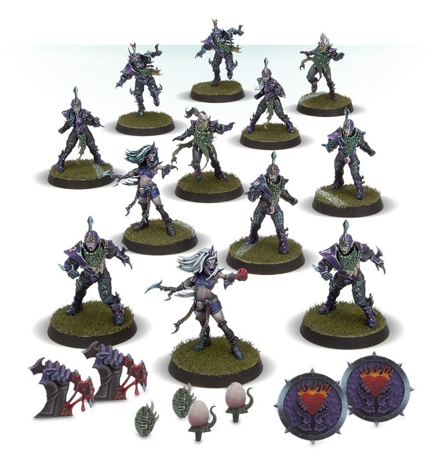

**TIER 1**

### Positionals

| Qty  | Position         | M | S | AG | P  | AR | Skills                                | Primary | Secondary | Cost |
| ---- | ---------------- | - | - | -- | -- | -- | ------------------------------------- | ------- | --------- | ---- |
| 0-12 | Dark Elf Lineman | 6 | 3 | 2+ | 4+ | 9+ |                                       | A G    | S         | 70K  |
| 0-2  | Runner           | 7 | 3 | 2+ | 3+ | 8+ | • [Dump-Off]                            | A G P   | S         | 80K  |
| 0-4  | Blitzer          | 7 | 3 | 2+ | 4+ | 9+ | • [Block]                               | A G    | P S      | 100K |
| 0-2  | Assassin         | 7 | 3 | 2+ | 5+ | 8+ | • [Shadowing]  • [Stab]              | A G     | P S      | 85K  |
| 0-2  | Witch Elf        | 7 | 3 | 2+ | 5+ | 8+ | • [Dodge]  • [Frenzy]   • [Jump Up] | A G     | P S       | 110K |

### Special Rules

* [Elven Kingdoms League]

### Staff

* [Cheerleader] - 10K
* [Assistant Coach] - 10K
* [Re-roll] - 50K
* [Apothecary]  - 50K

### Starplayers

* [Akhorne The Squirrel]
* [Eldril Sidewinder]
* [Gloriel Summerbloom]
* [Grak and Crumbleberry]
* [Helmut Wulf]
* [Kiroth Krakeneye]
* [Morg'n Thorg]
* [Roxanna Darknail]
* [The Swift Twins]
* [Willow Rosebark]
* [Zolcath the Zoat]

### Inducements

* [Temp Agency Cheerleaders] - 20K
* [Part-time Assistant Coaches] - 20K
* [Weather Mage] - 30K
* [Unlimited Mercenary Player] - 30K
* [Bloodweiser Kegs] - 50K
* [Special Plays] - 100K
* [Extra Team Training] - 100K
* [Bribe] - 100K
* [Wandering Apothecary] - 100K
* [Josef Bugman] - 100K
* [Biased Referee] - 120K
* [Hireling Sports-Wizard] (Wizard) - 150K
* [Halfling Master Chef] - 300K

### New Inducements

* [Stunty Superstar] (Specialized Mercenary) - 30K
* [Team Mascot] - 30K
* [Galandril Silverwater] - 40K
* [Legendary Lineman] (Specialized Mercenary) - 50K
* [Brutal Blocker] (Specialized Mercenary) - 50K
* [Kari Coldsteel] - 50K
* [Medicinal Unguent] - 60K
* [Reliable Ringer] (Specialized Mercenary) - 70K
* [The Trundlefoot Triplets] (Biased Referee) - 80K
* [Schielund Scharlitan] - 90K
* [Ayleen Andar] - 100K
* [Jorm the Ogre] (Biased Referee) - 120K
* [Bona Fide Big Guy] (Specialized Mercenary) - 130K
* [Asur High Mage] (Wizard) - 150K
* [Horatio X. Schottenheim] - 150K
* [Druchii Sports Sorceress] (Wizard) - 150K
* [Giant Mercenary] - 350K