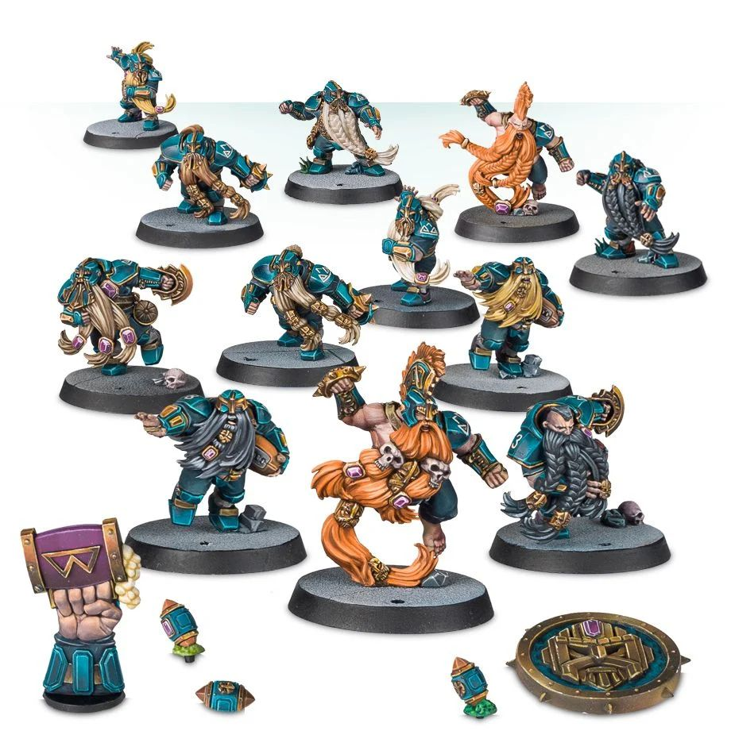

**TIER 1**

### Positionals

| Qty  | Position              | MA | ST | AG | PA  | AR  | Skills                                                                                                                                                          | Primary | Secondary | Cost |
| ---- | --------------------- | - | - | -- | -- | --- | --------------------------------------------------------------------------------------------------------------------------------------------------------------- | ------- | --------- | ---- |
| 0‑12 | Dwarf Blocker Lineman | 4 | 3 | 4+ | 5+ | 10+ | • [Block]  • [Tackle]   • [Thick Skull]                                                                                                                     | G S     | A         | 70K  |
| 0‑2  | Runner                | 6 | 3 | 3+ | 4+ | 9+  | • [Sure Hands]  • [Thick Skull]                                                                                                                                  | G P     | A S       | 85K  |
| 0‑2  | Blitzer               | 5 | 3 | 3+ | 4+ | 10+ | • [Block]  • [Thick Skull]                                                                                                                                     | G S     | A P       | 80K  |
| 0‑2  | Troll Slayer          | 5 | 3 | 4+ | -  | 9+  | • [Block]  • [Dauntless]   • [Frenzy]   • [Thick Skull]                                                                                                    | G S     | A         | 95K  |
| 0‑1  | Deathroller           | 4 | 7 | 5+ | -  | 11+ | • [Break Tackle]  • [Dirty Player] (+2)   • [Juggernaut]   • [Loner] (5+)   • [Mighty Blow] (+1)   • [No Hands]   • [Secret Weapon]   • [Stand Firm] | S       | A G       | 170K |

### Special Rules

* [Worlds Edge Superleague]
* [Old World Classic]

### Staff

* [Cheerleader] - 10K
* [Assistant Coach] - 10K
* [Re-roll] - 50K
* [Apothecary]  - 50K

### Starplayers

* [Akhorne The Squirrel] - 80K
* [Barik Farblast] - 80K
* [Cindy Piewhistle] - 50K
* [Deeproot Strongbranch] - 280K
* [Frank 'n' Stein] - 250K
* [Grak and Crumbleberry] - 250K
* [Griff Oberwald] - 280K
* [Grim Ironjaw] - 200K
* [Grombrindal] - 210K
* [Helmut Wulf] - 140K
* [Ivar Eriksson] - 245K
* [Karla Von Kill] - 210K
* [Maple Highgrove] - 210K
* [Mighty Zug] - 220K
* [Morg 'n' Thorg] - 380K
* [Puggy Baconbreath] - 120K
* [Rumbelow Sheepskin] - 170K
* [Skrorg Snowpelt] - 250K
* [Skrull Halfheight] - 150K
* [Thorsson Stoutmead] - 170K

### Inducements

* [Part-time Assistant Coaches] - 20K
* [Temp Agency Cheerleaders] - 20K
* [Unlimited Mercenary Player] - 30K
* [Weather Mage] - 30K
* [Bloodweiser Kegs] - 50K
* [Bribe] - 100K
* [Extra Team Training] - 100K
* [Josef Bugman] - 100K
* [Special Plays] - 100K
* [Wandering Apothecary] - 100K
* [Biased Referee] - 120K
* [Halfling Master Chef] - 300K

### New Inducements

* [Stunty Superstar] (Specialized Mercenary) - 30K
* [Master of Ballistics] - 40K
* [Dwarfen Runesmith] - 50K
* [Kari Coldsteel] - 50K
* [Legendary Lineman] (Specialized Mercenary) - 50K
* [Halfling Hot Pot] - 60K
* [Medicinal Unguent] - 60K
* [Brutal Blocker] (Specialized Mercenary) - 70K
* [Reliable Ringer] (Specialized Mercenary) - 70K
* [Mungo Spinecracker] - 80K
* [Schielund Scharlitan] - 90K
* [Ayleen Andar] - 100K
* [Thoron Korensson] (Biased Referee) - 120K
* [Bona Fide Big Guy] (Specialized Mercenary) - 130K
* [Ranulf 'Red' Hokuli] (Biased Referee) - 130K
* [Wicked Witch] (Wizard) - 150K
* [Giant Mercenary] - 350K
