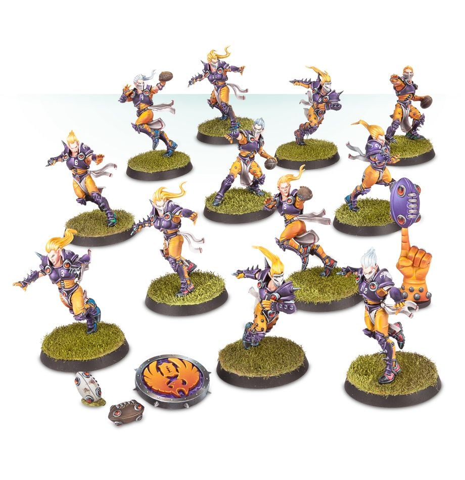

# Elven Union

### Positionals

| Qty  | Position | M | S | AG | P  | AR | Skills                          | Primary | Secondary | Cost |
| ---- | -------- | - | - | -- | -- | -- | ------------------------------- | ------- | --------- | ---- |
| 0-12 | Lineman  | 6 | 3 | 2+ | 4+ | 8+ |                                 | G       | A S       | 60K  |
| 0-4  | Catcher  | 8 | 3 | 2+ | 4+ | 8+ | Catch   Nerves of Steel    | G       | A S       | 100K |
| 0-2  | Thrower  | 6 | 3 | 2+ | 2+ | 8+ | [Pass]                            | G       | A P       | 75K  |
| 0-2  | Blitzer  | 7 | 3 | 2+ | 3+ | 9+ | [Block]   Side Step | G       | A S P     | 115K |

### Special Rules

Elven Kingdoms League

### Staff

* [Cheerleader] - 10K
* [Assistant Coach] - 10K
* [Reroll] - 50K
* [Apothecary]  - 50K

### Starplayers

* [Akhorne The Squirrel]  
* [Helmut Wulf]           
* [Gloriel Summerbloom]   
* [Willow Rosebark]       
* [Eldril Sidewinder]     
* [Zolcath the Zoat]      
* [Grak and Crumbleberry] 
* [Roxanna Darknail]      
* [The Swift Twins]       
* [Morg'n Thorg]          

### Inducements

* [Temp Agency Cheerleaders] - 20K
* [Part-time Assistant Coaches] - 20K
* [Weather Mage] - 30K
* [Minus superstar] (Specialized Mercenary) - 30K
* [Team Mascot] - 30K
* [No Limit Mercenary] - 30K
* [Galandril Silverwater] - 40K
* [Bloodweiser Kegs] - 50K
* [Legendary Lineman] (Specialized Mercenary) - 50K
* [Brutal Blocker] (Specialized Mercenary) - 50K
* [Kari Coldsteel] - 50K
* [Medicinal Unguent] - 60K
* [Safe Provider] (Specialized Mercenary) - 70K
* [The Trundlefoot Triplets] (Biased Referee) - 80K
* [Schielund Scharlitan] - 90K
* [Special Plays] - 100K
* [Extra Training] - 100K
* [Bribe] - 100K
* [Wandering Apothecary] - 100K
* [Josef Bugman] - 100K
* [Ayleen Andar] - 100K
* [Biased Referee] - 120K
* [Jorm the Ogre] (Biased Referee) - 120K
* [Guaranteed Big Guy] (Specialized Mercenary) - 130K
* [Asur High Mage] (Wizard) - 150K
* [Hireling Sports-Wizard] (Wizard) - 150K
* [Horatio X]. Schottenheim - 150K
* [Druchii Sports Sorceress] (Wizard) - 150K
* [Halfling Master Chef] - 300K
* [Mercenary Giant] - 350K
