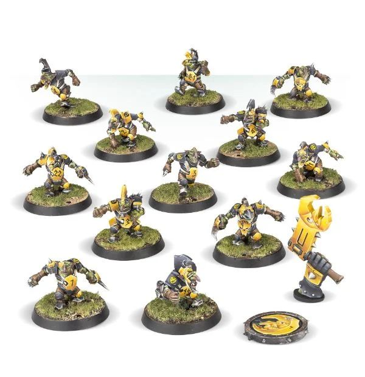

# Goblins

### Positionals

| Qty  | Position       | M | S | AG | P  | AR  | Skills                                                                                                                                          | Primary | Secondary | Cost |
| ---- | -------------- | - | - | -- | -- | --- | ----------------------------------------------------------------------------------------------------------------------------------------------- | ------- | --------- | ---- |
| 0-16 | Goblin Lineman | 6 | 2 | 3+ | 4+ | 8+  | [Dodge]   [Right Stuff]   [Stunty]                                                                                                        | A       | G S P     | 40K  |
| 0-2  | Trained Troll  | 4 | 5 | 5+ | 5+ | 10+ | [Always Hungry]   [Loner] (3+)   [Mighty Blow] (+1)   [Projectile Vomit]   [Really Stupid]   [Regeneration]   [Throw Team-mate] | S       | A G P     | 115K |
| 0-1  | Looney         | 6 | 2 | 3+ | -  | 8+  | Chainsaw   Secret Weapon   [Stunty]                                                                                                     | A       | G S       | 40K  |
| 0-1  | Bomma          | 6 | 2 | 3+ | 4+ | 8+  | Bombardier   [Dodge]   Secret Weapon   [Stunty]                                                                                    | A       | G S P     | 45K  |
| 0-1  | Doom Diver     | 6 | 2 | 3+ | 6+ | 8+  | [Right Stuff]   [Stunty]   Swoop                                                                                                          | A       | G S       | 60K  |
| 0-1  | ‘Ooligan      | 6 | 2 | 3+ | 6+ | 8+  | Dirty Player (+1)   Disturbing Presence   [Dodge]   [Right Stuff]   [Stunty]                                                    | A       | G S P     | 65K  |
| 0-1  | Fanatic        | 3 | 7 | 3+ | -  | 8+  | Ball and Chain   No Hands   Secret Weapon   [Stunty]                                                                               | S       | A G       | 70K  |
| 0-1  | Pogoer         | 7 | 2 | 3+ | 5+ | 8+  | [Dodge]   Pogo Stick   [Stunty]                                                                                                         | A       | G S P     | 75K  |

### Special Rules

Badlands Brawl
Bribery and Corruption
Underworld Challenge

### Staff

* [Cheerleader] - 10K
* [Assistant coach] - 10K
* [Reroll](s) - 60K
* [Apothecary]  - 50K

### Starplayers

* [Bomber Dribblesnot]    
* [Akhorne The Squirrel]  
* [Fungus the Loon]       
* [Nobbla Blackwart]      
* [Scrappa Sorehead]      
* [Helmut Wulf]           
* [Kreek Rustgouger]      
* [Glart Smashrip]        
* [Hakflem Skuttlespike]  
* [The Black Gobbo]       
* [Grak and Crumbleberry] 
* [Ripper Blogrot]        
* [Varag Ghoul-Chewer]    
* [Morg'n Thorg]          

### Inducements

* [Temp Agency Cheerleaders] - 20K
* [Part]-time Assistant Coaches - 20K
* [Weather mage] - 30K
* [Minus superstar] (Specialized Mercenary) - 30K
* [Team Mascot] - 30K
* [No limit mercenary] - 30K
* [Bottles of heady brew] - 40K
* [Bloodweiser Kegs] - 50K
* [Bribe] - 50K
* [Legendary Lineman] (Specialized Mercenary) - 50K
* [Brutal Blocker] (Specialized Mercenary) - 50K
* [Waaagh]! Drummer - 50K
* [Medicinal Unguent] - 60K
* [Safe Provider] (Specialized Mercenary) - 70K
* [Krot Shockwisker] - 70K
* [Biased Referee] - 80K
* [Mungo Spinecracker] - 80K
* [Jorm the Ogre] (Biased Referee) - 80K
* [The trundlefoot triplets] (Biased Referee) - 80K
* [Papa Skullbones] - 80K
* [Fink da Fixer] - 90K
* [Schielund Scharlitan] - 90K
* [Guaranteed Big Guy] (Specialized Mercenary) - 130K
* [Hireling Sports]-Wizard (Wizard) - 150K
* [Ogre Firebelly] (Wizard) - 150K
* [Night Golbin Shaman] (Wizard) - 150K
* [Wicked Witch] (Wizard) - 150K
