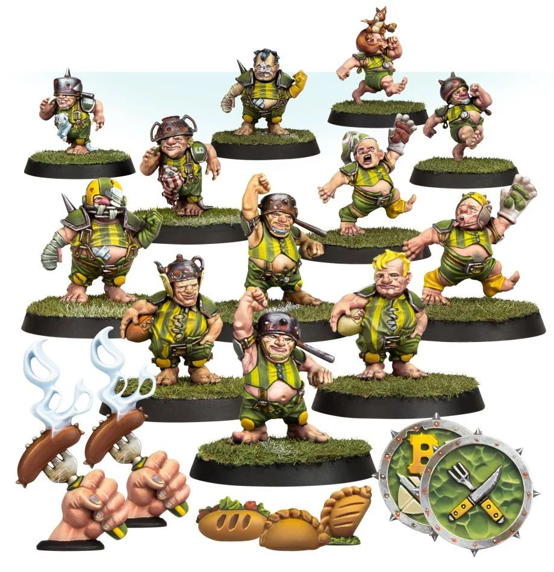

**TIER 3**

### Positionals

| Qty  | Position                 | MA | ST | AG | PA  | AR  | Skills                                                                                                                                   | Primary | Secondary | Cost |
| ---- | ------------------------ | - | - | -- | -- | --- | ---------------------------------------------------------------------------------------------------------------------------------------- | ------- | --------- | ---- |
| 0-16 | Halfling Hopeful Lineman | 5 | 2 | 3+ | 4+ | 7+  | • [Dodge]  • [Right Stuff]   • [Stunty]                                                                                              | A       | G S       | 30K  |
| 0-2  | Halfling Hefty           | 5 | 2 | 3+ | 3+ | 8+  | • [Dodge]  • [Fend]   • [Stunty]                                                                                                     | A P     | G S       | 50K  |
| 0-2  | Halfling Catcher         | 5 | 2 | 3+ | 5+ | 7+  | • [Catch]  • [Dodge]   • [Right Stuff]   • [Sprint]   • [Stunty]                                                               | A       | G S       | 55K  |
| 0-2  | Altern Forest Treeman    | 2 | 6 | 5+ | 5+ | 11+ | • [Mighty Blow] (+1)  • [Stand Firm]   • [Strong Arm]   • [Take Root]   • [Thick Skull]   • [Throw Team-mate]   • [Timmm-ber!] | S       | A G P     | 120K |

### Special Rules

* [Old World Classic]
* [Halfling Thimble Cup]

### Staff

* [Cheerleader] - 10K
* [Assistant Coach] - 10K
* [Re-roll] - 60K
* [Apothecary]  - 50K

### Starplayers

* [Akhorne The Squirrel] - 80K
* [Barik Farblast] - 80K
* [Cindy Piewhistle] - 50K
* [Deeproot Strongbranch] - 280K
* [Frank 'n' Stein] - 250K
* [Grak and Crumbleberry] - 250K
* [Griff Oberwald] - 280K
* [Grim Ironjaw] - 200K
* [Grombrindal] - 210K
* [Helmut Wulf] - 140K
* [Ivar Eriksson] - 245K
* [Karla Von Kill] - 210K
* [Mighty Zug] - 220K
* [Morg 'n' Thorg] - 380K
* [Puggy Baconbreath] - 120K
* [Rodney Roachbait] - 70K
* [Rowana Forestfoot] - 160K
* [Rumbelow Sheepskin] - 170K
* [Skrorg Snowpelt] - 250K
* [Thorsson Stouthead] - 170K

### Inducements

* [Part-time Assistant Coaches] - 20K
* [Temp Agency Cheerleaders] - 20K
* [Unlimited Mercenary Player] - 30K
* [Weather Mage] - 30K
* [Bloodweiser Kegs] - 50K
* [Bribe] - 100K
* [Extra Team Training] - 100K
* [Halfling Master Chef] - 100K
* [Josef Bugman] - 100K
* [Special Plays] - 100K
* [Wandering Apothecary] - 100K
* [Biased Referee] - 120K
* [Hireling Sports-Wizard] (Wizard) - 150K

### New Inducements

* [Master of Ballistics] - 30K
* [Stunty Superstar] (Specialized Mercenary) - 30K
* [Team Mascot] - 30K
* [Bottles of Heady Brew] - 40K
* [The Trundlefoot Triplets] (Biased Referee) - 40K
* [Brutal Blocker] (Specialized Mercenary) - 50K
* [Dwarfen Runesmith] - 50K
* [Kari Coldsteel] - 50K
* [Legendary Lineman] (Specialized Mercenary) - 50K
* [Halfling Hot Pot] - 60K
* [Medicinal Unguent] - 60K
* [Reliable Ringer] (Specialized Mercenary) - 70K
* [Mungo Spinecracker] - 80K
* [Schielund Scharlitan] - 90K
* [Ayleen Andar] - 100K
* [Jorm the Ogre] (Biased Referee) - 120K
* [Bona Fide Big Guy] (Specialized Mercenary) - 130K
* [Ranulf 'Red' Hokuli] (Biased Referee) - 130K
* [Horatio X. Schottenheim] - 150K
* [Wicked Witch] (Wizard) - 150K
* [Giant Mercenary] - 350K
