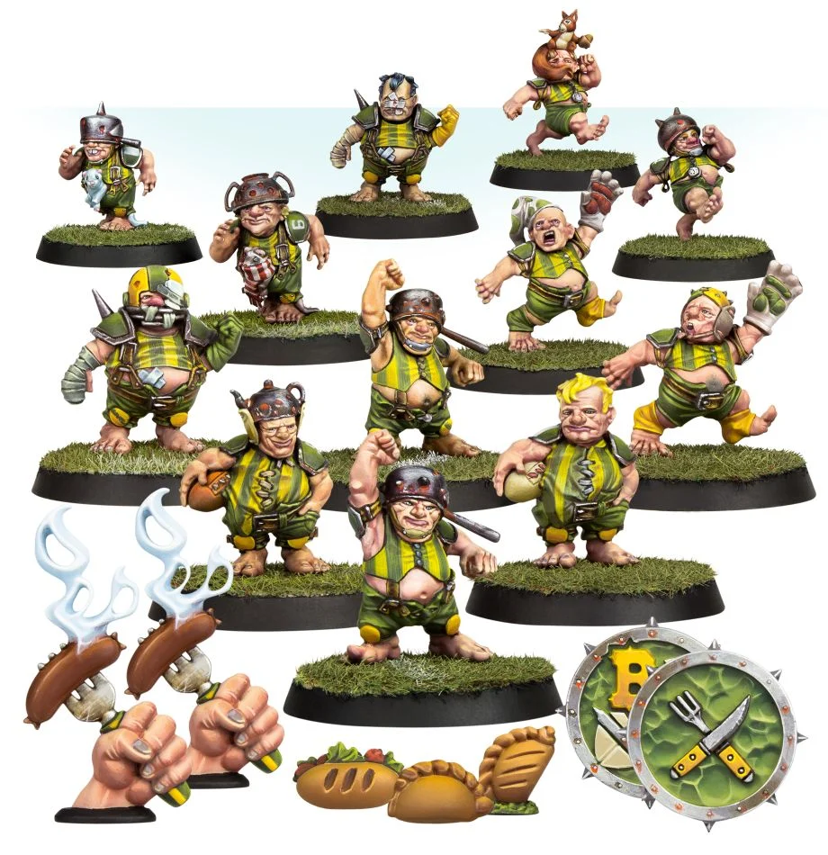

**TIER 3**

### Positionals

| Qty  | Position                 | M | S | AG | P  | AR  | Skills                                                                                                                                   | Primary | Secondary | Cost |
| ---- | ------------------------ | - | - | -- | -- | --- | ---------------------------------------------------------------------------------------------------------------------------------------- | ------- | --------- | ---- |
| 0-16 | Halfling Hopeful Lineman | 5 | 2 | 3+ | 4+ | 7+  | • [Dodge]  • [Right Stuff]   • [Stunty]                                                                                              | A       | G S       | 30K  |
| 0-2  | Halfling Hefty           | 5 | 2 | 3+ | 3+ | 8+  | • [Dodge]  • [Fend]   • [Stunty]                                                                                                     | A P     | G S       | 50K  |
| 0-2  | Halfling Catcher         | 5 | 2 | 3+ | 5+ | 7+  | • [Catch]  • [Dodge]   • [Right Stuff]   • [Sprint]   • [Stunty]                                                               | A       | G S       | 55K  |
| 0-2  | Altern Forest Treeman    | 2 | 6 | 5+ | 5+ | 11+ | • [Mighty Blow] (+1)  • [Stand Firm]   • [Strong Arm]   • [Take Root]   • [Thick Skull]   • [Throw Team-mate]   • [Timmm-ber!] | S       | A G P     | 120K |

### Special Rules

Old World Classic
Halfling Thimble Cup

### Staff

* [Cheerleader] - 10K
* [Assistant Coach] - 10K
* [Re-roll] - 60K
* [Apothecary]  - 50K

### Starplayers

* [Akhorne The Squirrel]
* [Barik Farblast]
* [Cindy Piewhistle]
* [Deeproot Strongbranch]
* [Frank 'n' Stein]
* [Grak and Crumbleberry]
* [Griff Oberwald]
* [Grim Ironjaw]
* [Grombrindal, The White Dwarf]
* [Helmut Wulf]
* [Ivar Eriksson]
* [Karla Von Kill]
* [Mighty Zug]
* [Morg'n Thorg]
* [Puggy Baconbreath]
* [Rumbelow Sheepskin]
* [Skrorg Snowpelt]
* [Thorsson Stouthead]

### Inducements

* [Temp Agency Cheerleaders] - 20K
* [Part-time Assistant Coaches] - 20K
* [Weather mage] - 30K
* [Minus superstar] (Specialized Mercenary) - 30K
* [Master of Ballistics] - 30K
* [Team Mascot] - 30K
* [Unlimited Mercenary Player] - 30K
* [Bottles of heady brew] - 40K
* [The trundlefoot triplets] (Biased Referee) - 40K
* [Bloodweiser Kegs] - 50K
* [Legendary Lineman] (Specialized Mercenary) - 50K
* [Brutal Blocker] (Specialized Mercenary) - 50K
* [Mighty Blow] (+2) + Loner(5+) - 60K
* [[Pogo Stick]] - 50K
* [[Chainsaw]] + [Secret Weapon] + [No Hands] - 60K
* [Frenzy] + Unchanneled Fury + [Horns] - [Throw] Teammate - 80K
* [Hireling Sports-Wizard] (Wizard) - 150K
* [Ranulf] 'Red' Hokuli (Biased Referee) - 130K
* [Wandering Apothecary] - 100K
* [Extra Team Training] - 100K
* [Halfling Master Chef] - 100K
* [Halfling Pot Pot] - 60K
* [Guaranteed Big Guy] (Specialized Mercenary) - 130K
* [Safe Provider] (Specialized Mercenary) - 70K
* [Medicinal Unguent] - 60K
* [Schielund Scharlitan] - 90K
* [Josef Bugman] - 100K
* [Ayleen Andar] - 100K
* [Biased Referee] - 120K
* [Jorm the Ogre] (Biased Referee) - 120K
* [Horatio X. Schottenheim] - 150K
* [Wicked Witch] (Wizard) - 150K
