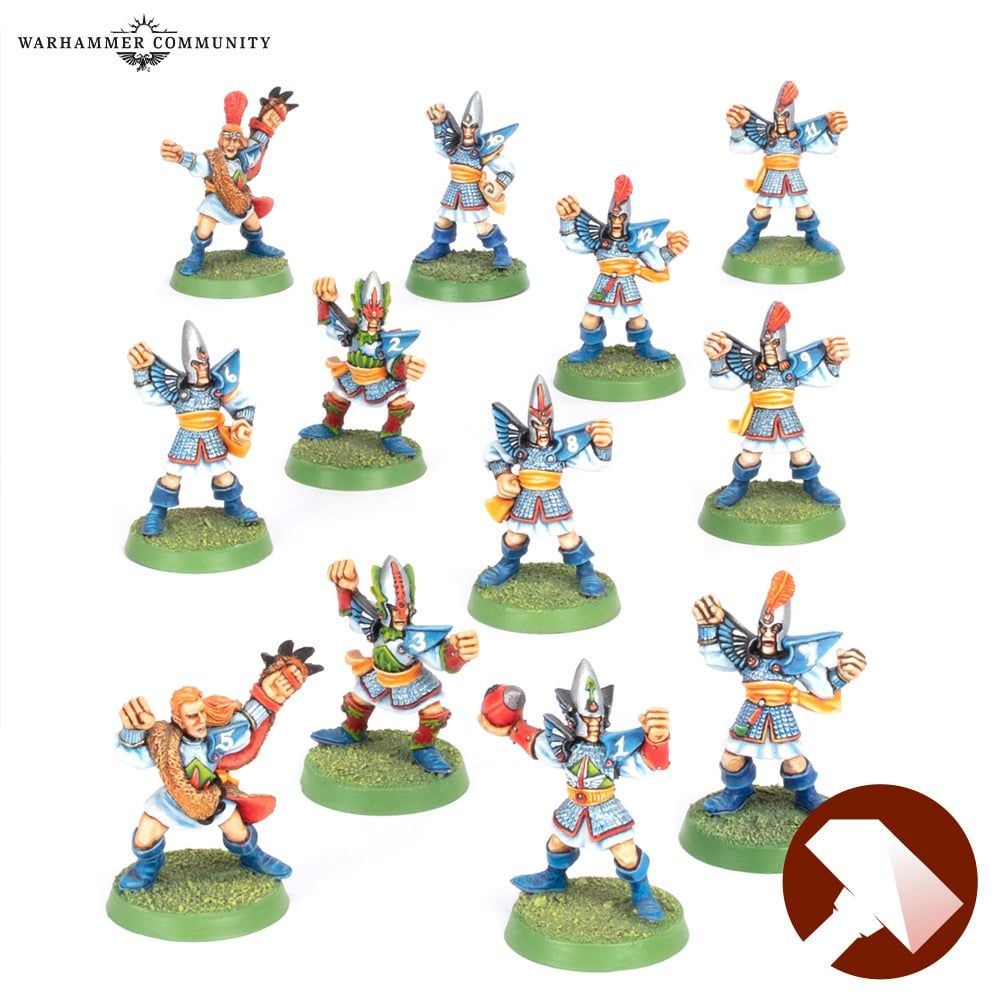

**TIER 1**

### Positionals

| Qty  | Position | MA | ST | AG | PA  | AR | Skills                                                      | Primary | Secondary | Cost |
| ---- | -------- | - | - | -- | -- | -- | ----------------------------------------------------------- | ------- | --------- | ---- |
| 0-16 | Lineman  | 6 | 3 | 2+ | 4+ | 9+ |                                                             | A G     | P S       | 70K  |
| 0-4  | Catcher  | 8 | 3 | 2+ | 5+ | 8+ | • [Catch]                                                 | A G     | S         | 90K  |
| 0-2  | Thrower  | 6 | 3 | 2+ | 2+ | 9+ | • [Cloud Burster]  • [Pass]   • [Safe Pass] | A G P   | S         | 100K |
| 0-2  | Blitzer  | 7 | 3 | 2+ | 4+ | 9+ | • [Block]                                                 | A G     | P S       | 100K |

### Special Rules

* [Elven Kingdoms League]

### Staff

* [Cheerleader] - 10K
* [Assistant Coach] - 10K
* [Re-roll] - 50K
* [Apothecary]  - 50K

### Starplayers

* [Akhorne The Squirrel]
* [Eldril Sidewinder]
* [Gloriel Summerbloom]
* [Grak and Crumbleberry]
* [Helmut Wulf]
* [Kiroth Krakeneye]
* [Morg 'n' Thorg]
* [Roxanna Darknail]
* [The Swift Twins]
* [Willow Rosebark]
* [Zolcath the Zoat]

### Inducements

* [Part-time Assistant Coaches] - 20K
* [Temp Agency Cheerleaders] - 20K
* [Unlimited Mercenary Player] - 30K
* [Weather mage] - 30K
* [Bloodweiser Kegs] - 50K
* [Bribe] - 100K
* [Extra Team Training] - 100K
* [Josef Bugman] - 100K
* [Special Plays] - 100K
* [Wandering Apothecary] - 100K
* [Biased Referee] - 120K
* [Hireling Sports-Wizard] (Wizard) - 150K
* [Halfling Master Chef] - 300K

### New Inducements

* [Stunty Superstar] (Specialized Mercenary) - 30K
* [Team Mascot] - 30K
* [Galandril Silverwater] - 40K
* [Brutal Blocker] (Specialized Mercenary) - 50K
* [Kari Coldsteel] - 50K
* [Legendary Lineman] (Specialized Mercenary) - 50K
* [Medicinal Unguent] - 60K
* [Reliable Ringer] (Specialized Mercenary) - 70K
* [The Trundlefoot Triplets] (Biased Referee) - 80K
* [Schielund Scharlitan] - 90K
* [Ayleen Andar] - 100K
* [Jorm the Ogre] (Biased Referee) - 120K
* [Bona Fide Big Guy] (Specialized Mercenary) - 130K
* [Asur High Mage] (Wizard) - 150K
* [Druchii Sports Sorceress] (Wizard) - 150K
* [Horatio X. Schottenheim] - 150K
* [Giant Mercenary] - 350K
