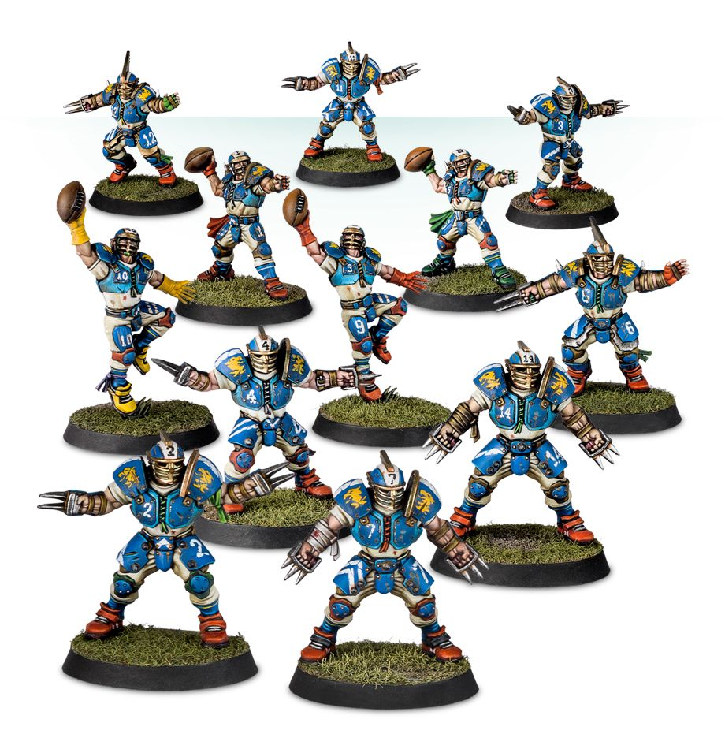

**TIER 2**

### Positionals

| Qty  | Position         | M | S | AG | P  | AR  | Skills                                                                                               | Primary | Secondary | Cost |
| ---- | ---------------- | - | - | -- | -- | --- | ---------------------------------------------------------------------------------------------------- | ------- | --------- | ---- |
| 0-16 | Human Lineman    | 6 | 3 | 3+ | 4+ | 9+  |                                                                                                      | G       | A S       | 50K  |
| 0-2  | Thrower          | 6 | 3 | 3+ | 2+ | 9+  | [Pass]  [Sure Hands]                                                                           | G P     | A S       | 80K  |
| 0-4  | Catcher          | 8 | 2 | 3+ | 5+ | 8+  | Catch  [Dodge]                                                                                  | A G     | S P       | 65K  |
| 0-4  | Blitzer          | 7 | 3 | 3+ | 4+ | 9+  | [Block]                                                                                              | G S     | A P       | 85K  |
| 0-3  | Halfling Hopeful | 5 | 2 | 3+ | 4+ | 7+  | [Dodge]  [Right Stuff]   [Stunty]                                                          | A       | G S       | 30K  |
| 0-1  | Ogre             | 5 | 5 | 4+ | 5+ | 10+ | [Bone Head]  [Loner] (4+)   [Mighty Blow] (+1)   [Thick Skull]   [Throw Team-mate] | S       | A G       | 140K |

### Special Rules

Old World Classic

### Staff

* [Cheerleader] - 10K
* [Assistant Coach] - 10K
* [Reroll] - 50K
* [Apothecary]  - 50K

### Starplayers

* [Cindy Piewhistle]
* [Akhorne The Squirrel]
* [Barik Farblast]
* [Puggy Baconbreath]
* [Helmut Wulf]
* [Rumbelow Sheepskin]
* [Thorsson Stouthead]
* [Grim Ironjaw]
* [Karla Von Kill]
* [Grombrindal, The White Dwarf]
* [Mighty Zug]
* [Ivar Eriksson]
* [Grak and Crumbleberry]
* [Frank 'n' Stein]
* [Skrorg Snowpelt]
* [Deeproot Strongbranch]
* [Griff Oberwald]
* [Morg'n Thorg]

### Inducements

* [Temp Agency Cheerleaders] - 20K
* [Part-time Assistant Coaches] - 20K
* [Weather Mage] - 30K
* [Minus superstar] (Specialized Mercenary) - 30K
* 
* [Two or more agility skills]: +20K each
* [One only general skill] (but Dirty Player): +40K
* [One only [Pass] skill]: +20K
* 
* +1MV: +30K
* +1AG: +40K
* +1P: +30K
* +1AV: +30K
* -1 to any characteristic: -10K (mercenary cost 30K at least)
* [No limit mercenary] - 30K
* [Master of Ballistics] - 40K
* [Bloodweiser Kegs] - 50K
* [Legendary Lineman] (Specialized Mercenary) - 50K
* [Brutal Blocker] (Specialized Mercenary) - 50K
* [Kari Coldsteel] - 50K
* [Dwarfen Runesmith] - 50K
* [Medicinal Unguent] - 60K
* [Safe Provider] (Specialized Mercenary) - 70K
* [Josef Bugman] - 100K
* [Ayleen Andar] - 100K
* [Biased Referee] - 120K
* [Guaranteed Big Guy] (Specialized Mercenary) - 130K
* [Ranulf] 'Red' Hokuli (Biased Referee) - 130K
* [Wicked Witch] (Wizard) - 150K
* [Halfling Master Chef] - 300K
* [Mercenary Giant] - 350K

[One agility skill]: +10K
[One only mutation]: +30K
