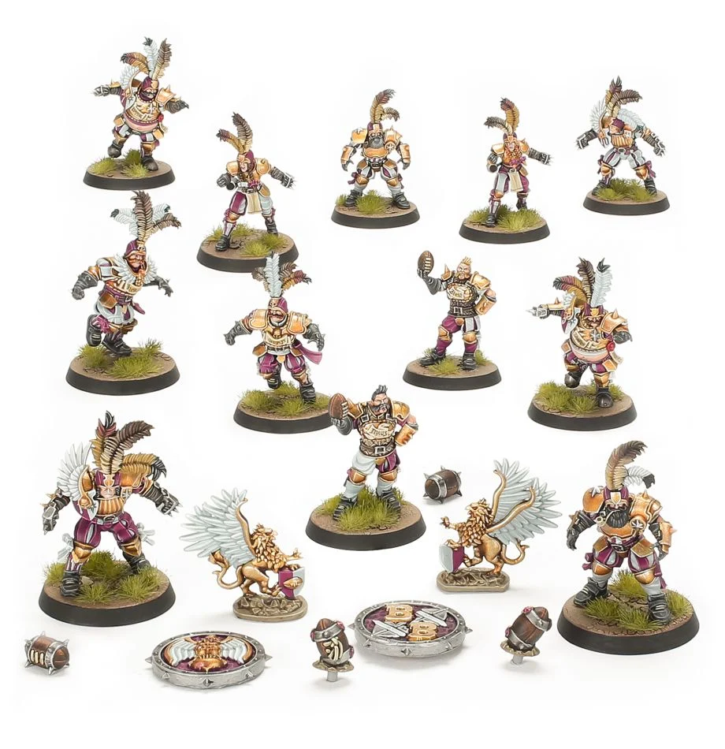

**TIER 2**

### Positionals

| Qty  | Position                  | M | S | AG | P  | AR  | Skills                                                                                                 | Primary | Secondary | Cost |
| ---- | ------------------------- | - | - | -- | -- | --- | ------------------------------------------------------------------------------------------------------ | ------- | --------- | ---- |
| 0-12 | Imperial Retainer Lineman | 6 | 3 | 4+ | 4+ | 8+  | [Fend]                                                                                                 | G       | A S       | 45K  |
| 0-2  | Imperial Thrower          | 6 | 3 | 3+ | 3+ | 9+  | [Pass]  [Running]   [Pass]                                                                   | G P     | A S       | 75K  |
| 0-2  | Noble Blitzer             | 7 | 3 | 3+ | 4+ | 9+  | [Block]  [Catch]                                                                                  | A G     | P S       | 105K |
| 0-4  | Bodyguard                 | 6 | 3 | 3+ | 5+ | 9+  | [Stand Firm]  [Wrestle]                                                                           | G S     | A         | 90K  |
| 0-1  | Ogre                      | 5 | 5 | 4+ | 5+ | 10+ | [Bone Head]  [Loner] (4+)   [Mighty Blow] (+1)   [Thick Skull]   [Throw Team-mate] | S       | A G       | 140K |

### Special Rules

Old World Classic

### Staff

* [Cheerleader] - 10K
* [Assistant Coach] - 10K
* [Reroll] - 70K
* [Apothecary]  - 50K

### Starplayers

* [Cindy Piewhistle]
* [Akhorne The Squirrel]
* [Barik Farblast]
* [Puggy Baconbreath]
* [Helmut Wulf]
* [Rumbelow Sheepskin]
* [Thorsson Stouthead]
* [Grim Ironjaw]
* [Karla Von Kill]
* [Grombrindal, The White Dwarf]
* [Mighty Zug]
* [Ivar Eriksson]
* [Frank 'n' Stein]
* [Skrorg Snowpelt]
* [Deeproot Strongbranch]
* [Griff Oberwald]
* [Morg'n Thorg]

### Inducements

* [Temp Agency Cheerleaders] - 20K
* [Part-time Assistant Coaches] - 20K
* [Weather Mage] - 30K
* [Minus superstar] (Specialized Mercenary) - 30K
* [No limit Mercenary] - 30K
* [Master of Ballistics] - 40K
* [Bloodweiser Kegs] - 50K
* [Legendary Lineman] (Specialized Mercenary) - 50K
* [Brutal Blocker] (Specialized Mercenary) - 50K
* [Kari Coldsteel] - 50K
* [Dwarfen Runesmith] - 50K
* [Medicinal Unguent] - 60K
* [Safe Provider] (Specialized Mercenary) - 70K
* [Mighty Blow] (+2) + Loner(5+) - 60K
* [Big Hand] - 30K
* [Extra Arms] - 20K
* [Ranulf] 'Red' Hokuli (Biased Referee) - 130K
* [Wicked Witch] (Wizard) - 150K
* [Halfling Master Chef] - 300K
* [Mercenary Giant] - 350K
