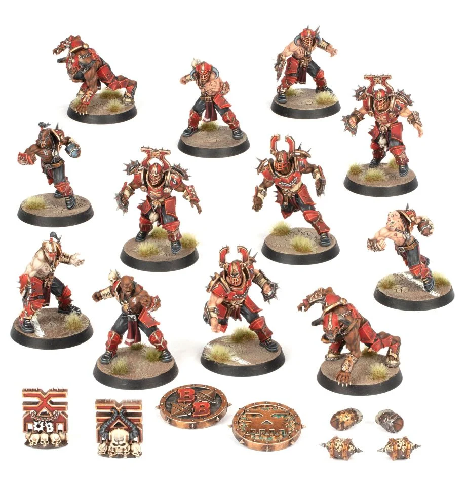

# Khorne

### Positionals

| Qty  | Position                   | M | S | AG | P  | AR  | Skills                                                                                 | Primary | Secondary | Cost |
| ---- | -------------------------- | - | - | -- | -- | --- | -------------------------------------------------------------------------------------- | ------- | --------- | ---- |
| 0-16 | Bloodborn Marauder Lineman | 6 | 3 | 3+ | 4+ | 8+  | [Frenzy]                                                                                 | G       | M A S     | 50K  |
| 0-4  | Khorngor                   | 6 | 3 | 3+ | 4+ | 9+  | [Horns]   Juggernaut                                                                | G       | S M A P   | 70K  |
| 0-4  | Bloodseeker                | 5 | 4 | 4+ | 6+ | 10+ | [Frenzy]                                                                                 | G       | S M A     | 110K |
| 0-1  | Bloodspawn                 | 5 | 5 | 4+ | -  | 9+  | [Claws]   [Frenzy]   [Loner] (4+)   [Mighty Blow] (+1)   [Unchannelled Fury] | S       | M A G     | 160K |

### Special Rules

Favoured of Khorne

### Staff

* [Cheerleader] - 10K
* [Assistant Coach] - 10K
* [Reroll] - 60K
* [Apothecary]  - 50K

### Starplayers

* [Akhorne The Squirrel]    
* [Max Spleenripper]        
* [Helmut Wulf]             
* [Kreek Rustgouger]        
* [Withergrasp Doubledrool] 
* [Glart Smashrip]          
* [Scyla Anfingrimm]        
* [Hakflem Skuttlespike]    
* [Grashnak Blackhoof]      
* [Lord Borak]              
* [Morg'n Thorg]            

### Inducements

* [Temp Agency Cheerleaders] - 20K
* [Part-time Assistant Coaches] - 20K
* [Weather mage] - 30K
* [Minus superstar] (Specialized Mercenary) - 30K
* [Team Mascot] - 30K
* [No limit mercenary] - 30K
* [Bloodweiser Kegs] - 50K
* [Legendary Lineman] (Specialized Mercenary) - 50K
* [Brutal Blocker] (Specialized Mercenary) - 50K
* [Medicinal Unguent] - 60K
* [Safe Provider] (Specialized Mercenary) - 70K
* [The Trundlefoot Triplets] (Biased Referee) - 80K
* [Papa Skullbones] - 80K
* [Ayleen Andar] - 100K
* [Special Plays] - 100K
* [Extra training] - 100K
* [Bribe] - 100K
* [Wandering Apothecary] - 100K
* [Josef Bugman] - 100K
* [Biased Referee] - 120K
* [Jorm the Ogre] (Biased Referee) - 120K
* [Guaranteed Big Guy] (Specialized Mercenary) - 130K
* [Chaos Sorcerer] (Wizard) - 150K
* [Hireling Sports-Wizard] (Wizard) - 150K
* [Horatio X]. Schottenheim - 150K
* [Druchii Sports Sorceress] (Wizard) - 150K
* [Halfling Master Chef] - 300K
* [Mercenary Giant] - 350K
