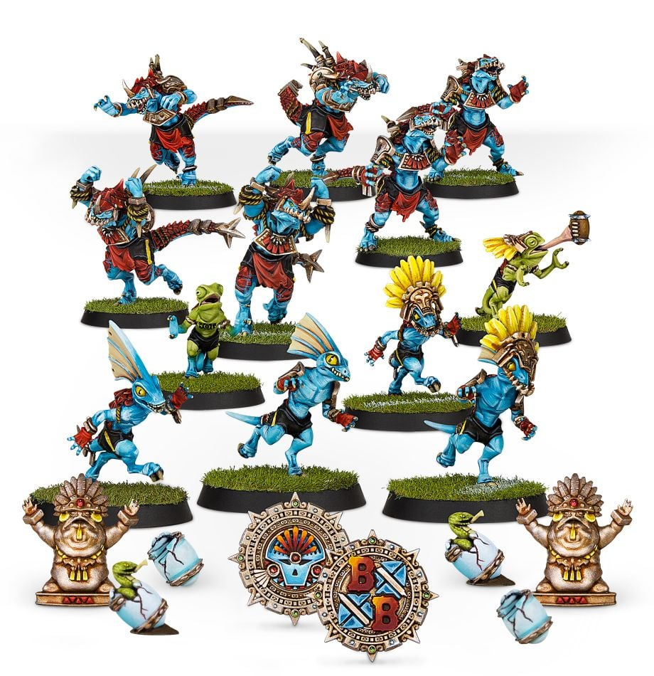

**TIER 1**

### Positionals

| Qty  | Position             | MA | ST | AG | PA  | AR  | Skills                                                                                                 | Primary | Secondary | Cost |
| ---- | -------------------- | - | - | -- | -- | --- | ------------------------------------------------------------------------------------------------------ | ------- | --------- | ---- |
| 0-12 | Skink Runner Lineman | 8 | 2 | 3+ | 4+ | 8+  | • [Dodge]  • [Stunty]                                                                                 | A       | G P S     | 60K  |
| 0-2  | Chameleon Skink      | 7 | 2 | 3+ | 3+ | 8+  | • [Dodge]  • [On the Ball]   • [Shadowing]   • [Stunty]                                           | A       | G P S     | 70K  |
| 0-6  | Saurus Blocker       | 6 | 4 | 5+ | 6+ | 10+ |                                                                                                        | G S     | A         | 85K  |
| 0-1  | Kroxigor             | 6 | 5 | 5+ | -  | 10+ | • [Bone Head]  • [Loner] (4+)   • [Mighty Blow] (+1)   • [Prehensile Tail]   • [Thick Skull] | S       | A G       | 140K |

### Special Rules

* [Lustrian Superleague]

### Staff

* [Cheerleader] - 10K
* [Assistant Coach] - 10K
* [Re-roll] - 70K
* [Apothecary]  - 50K

### Starplayers

* [Akhorne The Squirrel] - 80K
* [Anqi Panqi] - 190K
* [Boa Kon'ssstriktr] - 200K
* [Dribl and Drull] - 190K
* [Estelle la Veneaux] - 190K
* [Glotl Stop] - 270K
* [Grak and Crumbleberry] - 250K
* [Grombrindal] - 210K
* [Helmut Wulf] - 140K
* [Karla Von Kill] - 210K
* [Mighty Zug] - 220K
* [Morg 'n' Thorg] - 380K
* [Zolcath the Zoat] - 230K

### Inducements

* [Part-time Assistant Coaches] - 20K
* [Temp Agency Cheerleaders] - 20K
* [Unlimited Mercenary Player] - 30K
* [Weather Mage] - 30K
* [Bloodweiser Kegs] - 50K
* [Bribe] - 100K
* [Extra Team Training] - 100K
* [Josef Bugman] - 100K
* [Special Plays] - 100K
* [Wandering Apothecary] - 100K
* [Biased Referee] - 120K
* [Hireling Sports-Wizard] (Wizard) - 150K
* [Halfling Master Chef] - 300K

### New Inducements

* [Stunty Superstar] (Specialized Mercenary) - 30K
* [Team Mascot] - 30K
* [Brutal Blocker] (Specialized Mercenary) - 50K
* [Kari Coldsteel] - 50K
* [Legendary Lineman] (Specialized Mercenary) - 50K
* [Medicinal Unguent] - 60K
* [Reliable Ringer] (Specialized Mercenary) - 70K
* [The Trundlefoot Triplets] (Biased Referee) - 80K
* [Schielund Scharlitan] - 90K
* [Ayleen Andar] - 100K
* [Jorm the Ogre] (Biased Referee) - 120K
* [Bona Fide Big Guy] (Specialized Mercenary) - 130K
* [Ranulf 'Red' Hokuli] (Biased Referee) - 130K
* [Horatio X. Schottenheim] - 150K
* [Slann Mage-Priest] (Wizard) - 200K
* [Giant Mercenary] - 350K
