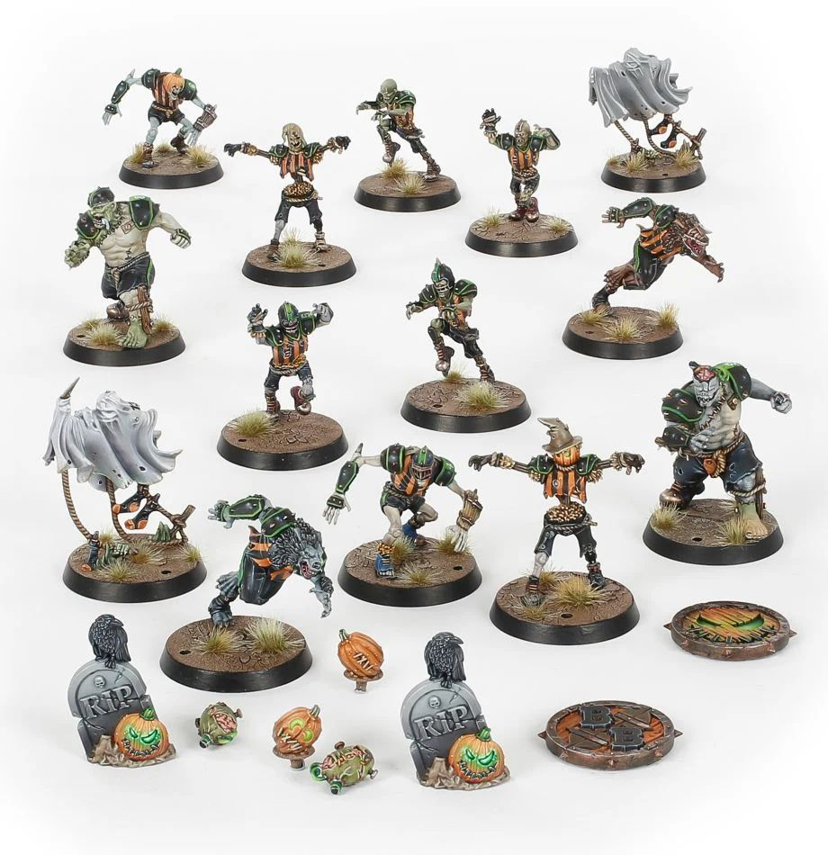

**TIER 2**

### Positionals

| Qty  | Position       | M | S | AG | P  | AR  | Skills                                                                                     | Primary | Secondary | Cost |
| ---- | -------------- | - | - | -- | -- | --- | ------------------------------------------------------------------------------------------ | ------- | --------- | ---- |
| 0-16 | Zombie Lineman | 4 | 3 | 4+ | -  | 9+  | • [Regeneration]                                                                             | G       | A S       | 40K  |
| 0-2  | Ghoul Runner   | 7 | 3 | 3+ | 4+ | 8+  | • [Dodge]                                                                                    | A G     | P S       | 75K  |
| 0-2  | Wraith         | 6 | 3 | 3+ | -  | 9+  | • [Block]  • [Foul Appearance]   • [No Hands]   • [Regeneration]   • [Sidestep] | G S     | A         | 95K  |
| 0-2  | Werewolf       | 8 | 3 | 3+ | 4+ | 9+  | • [Claws]  • [Frenzy]   • [Regeneration]                                               | A G     | P S       | 125K |
| 0-2  | Flesh Golem    | 4 | 4 | 4+ | -  | 10+ | • [Regeneration]  • [Stand Firm]   • [Thick Skull]                                     | G S     | A         | 115K |

### Special Rules

* [Sylvanian Spotlight]
* [Masters of Undeath]

### Staff

* [Cheerleader] - 10K
* [Assistant Coach] - 10K
* [Re-roll] - 70K

### Starplayers

* [Akhorne The Squirrel]
* [Bryce 'The Slice' Cambuel]
* [Frank 'n' Stein]
* [Grak and Crumbleberry]
* [Gretchen Wächter 'The Blood Bowl Widow']
* [Helmut Wulf]
* [Skrull Halfheight]
* [Wilhelm Chaney]
* ['Captain' Karina Von Riesz]
* [Count Luthor von Drakenborg]
* [Ivan 'the Animal' Deathshroud]
* [Kiroth Krakeneye]

### Inducements

* [Temp Agency Cheerleaders] - 20K
* [Part-time Assistant Coaches] - 20K
* [Weather Mage] - 30K
* [Unlimited Mercenary Player] - 30K
* [Bloodweiser Kegs] - 50K
* [Special Plays] - 100K
* [Extra Team Training] - 100K
* [Bribe] - 100K
* [Mortuary Assistant] - 100K
* [Josef Bugman] - 100K
* [Hireling Sports-Wizard] (Wizard) - 150K
* [Halfling Master Chef] - 300K

### New Inducements

* [Stunty Superstar] (Specialized Mercenary) - 30K
* [Team Mascot] - 30K
* [Legendary Lineman] (Specialized Mercenary) - 50K
* [Brutal Blocker] (Specialized Mercenary) - 50K
* [Medicinal Unguent] - 60K
* [Reliable Ringer] (Specialized Mercenary) - 70K
* [The Trundlefoot Triplets] (Biased Referee) - 80K
* [Schielund Scharlitan] - 90K
* [Ayleen Andar] - 100K
* [Bona Fide Big Guy] (Specialized Mercenary) - 130K
* [Professor Frönkelheim] - 130K
* [Horatio X. Schottenheim] - 150K
* [Wicked Witch] (Wizard) - 150K
* [Sports Necrotheurge] (Wizard) - 150K
* [Giant Mercenary] - 350K
