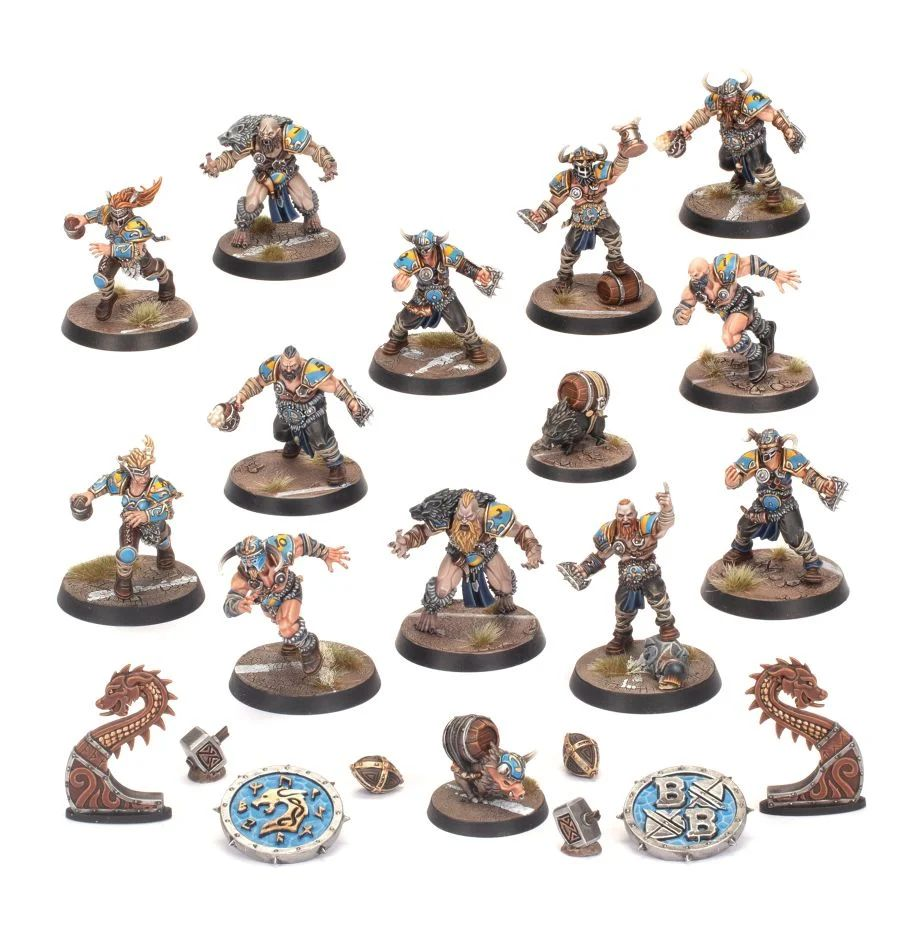

# Norses

### Positionals

| Qty  | Position             | M | S | AG | P  | AR | Skills                                                                                    | Primary | Secondary | Cost |
| ---- | -------------------- | - | - | -- | -- | -- | ----------------------------------------------------------------------------------------- | ------- | --------- | ---- |
| 0-16 | Norse Raider Lineman | 6 | 3 | 3+ | 4+ | 8+ | [Block]   Drunkard   [Thick Skull]                                         | G       | A S       | 50K  |
| 0-2  | Beer Boar            | 5 | 1 | 3+ | -  | 6+ | [Dodge]   No Hands   Pick-me-up   [Stunty]   Titchy                     |         | A         | 20K  |
| 0-2  | Norse Berzerker      | 6 | 3 | 3+ | 5+ | 8+ | [Block]   [Frenzy]   Jump up                                               | G       | S A       | 90K  |
| 0-2  | Valkyrie             | 7 | 3 | 3+ | 3+ | 8+ | Catch   Dauntless   [Pass]   Strip ball                                      | G       | A P S     | 95K  |
| 0-2  | Ulfwerener           | 6 | 4 | 4+ | -  | 9+ | [Frenzy]                                                                                    | G       | S A       | 105K |
| 0-1  | Yhetee               | 5 | 5 | 4+ | -  | 9+ | Claws   Disturbing Presence   [Frenzy]   [Loner] (4+)   [Unchannelled Fury] | S       | G A       | 140K |

### Special Rules

Choose either:
Old World Classic
Favoured of Khorne
Favoured of Chaos Undivided

### Staff

* [Cheerleader] - 10K
* [Assistant Coach] - 10K
* [Reroll] - 60K
* [Apothecary]  - 50K

### Starplayers

* [Cindy Piewhistle]             
* [Akhorne The Squirrel]         
* [Barik Farblast]               
* [Puggy Baconbreath]            
* [Max Spleenripper]             
* [Helmut Wulf]                  
* [Rumbelow Sheepskin]           
* [Kreek Rustgouger]             
* [Thorsson Stouthead]           
* [Withergrasp Doubledrool]      
* [Glart Smashrip]               
* [Grim Ironjaw]                 
* [Scyla Anfingrimm]             
* [Hakflem Skuttlespike]         
* [Karla Von Kill]               
* [Grombrindal, The White Dwarf] 
* [Mighty Zug]                   
* [Grashnak Blackhoof]           
* [Ivar Eriksson]                
* [Grak and Crumbleberry]              
* [Frank 'n' Stein]              
* [Skrorg Snowpelt]              
* [Lord Borak]                   
* [Deeproot Strongbranch]        
* [Griff Oberwald]               
* [Morg'n Thorg]                 

### Inducements

* [Temp Agency Cheerleaders] - 20K
* [Part-time Assistant Coaches] - 20K
* [Weather Mage] - 30K
* [Minus superstar] (Specialized Mercenary) - 30K
* [Team Mascot] - 30K
* [No Limit Mercenary] - 30K
* [Bloodweiser Kegs] - 50K
* [Legendary Lineman] (Specialized Mercenary) - 50K
* [Brutal Blocker] (Specialized Mercenary) - 50K
* [Medicinal Unguent] - 60K
* [Safe Provider] (Specialized Mercenary) - 70K
* [The Trundlefoot Triplets] (Biased Referee) - 80K
* [Schielund Scharlitan] - 90K
* [Ayleen Andar] - 100K
* [Special Plays] - 100K
* [Extra Training] - 100K
* [Bribe] - 100K
* [Mortuary Assistant] - 100K
* [Josef Bugman] - 100K
* [Hireling Sports-Wizard] (Wizard) - 150K
* [Guaranteed Big Guy] (Specialized Mercenary) - 130K
* [Professor Frönkelheim] - 130K
* [Horatio X]. Schottenheim - 150K
* [Wicked Witch] (Wizard) - 150K
* [Sports Necrotheurge] (Wizard) - 150K
* [Halfling Master Chef] - 300K
* [Mercenary Giant] - 350K
