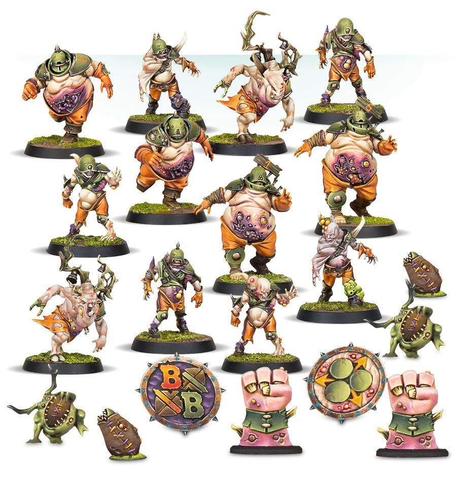

**TIER 2**

### Positionals

| Qty  | Position       | M | S | AG | P  | AR  | Skills                                                                                                                                                                          | Primary | Secondary | Cost |
| ---- | -------------- | - | - | -- | -- | --- | ------------------------------------------------------------------------------------------------------------------------------------------------------------------------------- | ------- | --------- | ---- |
| 0-12 | Rotter Lineman | 5 | 3 | 4+ | 6+ | 9+  | [Decay]  [Plague Ridden]                                                                                                                                                   | G M     | A S       | 35K  |
| 0-4  | Pestigor       | 6 | 3 | 3+ | 4+ | 9+  | [Horns]  [Plague Ridden]  [Regeneration]                                                                                                                              | G M S   | A P       | 75K  |
| 0-4  | Bloater        | 4 | 4 | 4+ | 6+ | 10+ | [Disturbing Presence]  [Foul Appearance]   [Plague Ridden]  [Regeneration]                                                                                       | G M S  | A         | 115K |
| 0-1  | Rotspawn       | 4 | 5 | 5+ | -  | 10+ | [Disturbing Presence]  [Foul Appearance]   [Loner] (4+)   [Mighty Blow] (+1)   [Plague Ridden]  [Really Stupid]   [Regeneration]   Tentacles | S       | A G M     | 140K |

### Special Rules

* [Favoured of Nurgle][Favoured Of..]

### Staff

* [Cheerleader] - 10K
* [Assistant Coach] - 10K
* [Reroll] - 70K

### Starplayers

* [Akhorne The Squirrel]
* [Max Spleenripper]
* [Helmut Wulf]
* [Kreek Rustgouger]
* [Withergrasp Doubledrool]
* [Bilerot Vomitflesh]
* [Glart Smashrip]
* [Scyla Anfingrimm]
* [Hakflem Skuttlespike]
* [Grashnak Blackhoof]
* [Grak and Crumbleberry]
* [Lord Borak]
* [Morg'n Thorg]

### Inducements

* [Temp Agency Cheerleaders] - 20K
* [Part-time Assistant Coaches] - 20K
* [Weather Mage] - 30K
* [Minus superstar] (Specialized Mercenary) - 30K
* [Cavorting Nurglings] - 30K
* [Team Mascot] - 30K
* [No Limit Mercenary] - 30K
* [Bloodweiser Kegs] - 50K
* [Legendary Lineman] (Specialized Mercenary) - 50K
* [Brutal Blocker] (Specialized Mercenary) - 50K
* [Medicinal Unguent] - 60K
* [Safe Provider] (Specialized Mercenary) - 70K
* [The Trundlefoot Triplets] (Biased Referee) - 80K
* [Papa Skullbones] - 80K
* [Ayleen Andar] - 100K
* [Special Plays] - 100K
* [Extra Training] - 100K
* [Bribe] - 100K
* [Wandering Apothecary] - 100K
* [Plague Doctor] - 100K
* [Josef Bugman] - 100K
* [Horatio X]. Schottenheim - 150K
* [Chaos Sorcerer] (Wizard) - 150K
* [Hireling Sports-Wizard] (Wizard) - 150K
* [Druchii Sports Sorceress] (Wizard) - 150K
* [Horticulturalist of Nurgle] (Wizard) - 150K
* [Halfling Master Chef] - 300K
* [Mercenary Giant] - 350K
