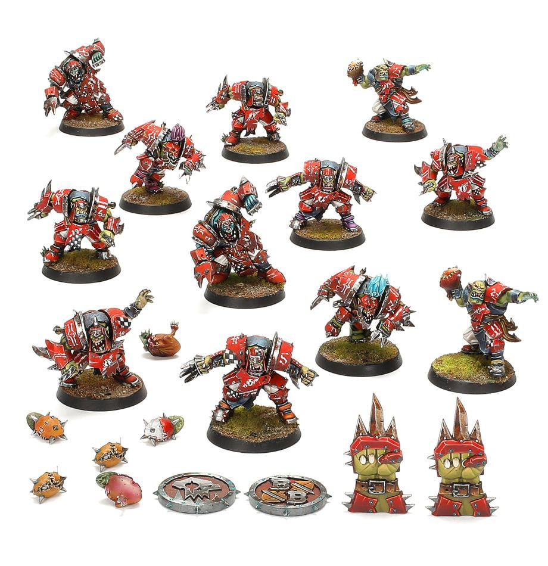

**TIER 2**

### Positionals

| Qty  | Position        | MA | ST | AG | PA | AR | Skills                                                                                                                                                       | Primary | Secondary | Cost |
| ---- | --------------- | - | - | -- | - | -- | ------------------------------------------------------------------------------------------------------------------------------------------------------------ | ------- | --------- | ---- |
| 0-16 | Orc Lineman     | 5 | 3 | 3+ | 4+ | 10+ | • [Animosity] (Orc Linemen)                                                                                                                                    | G       | A S       | 50K  |
| 0-2  | Thrower         | 5 | 3 | 3+ | 3+ | 9+  | • [Animosity] (All)  • [Pass]   • [Sure Hands]                                                                                                          | G P     | A S       | 65K  |
| 0-4  | Blitzer         | 6 | 3 | 3+ | 4+ | 10+ | • [Animosity] (All)  • [Block]                                                                                                                              | G S     | A P       | 80K  |
| 0-4  | Big Un          | 5 | 4 | 4+ | - | 10+ | • [Animosity] (Big Uns)                                                                                                                                        | G S     | A         | 90K  |
| 0-4  | Goblin          | 6 | 2 | 3+ | 4+ | 8+  | • [Dodge]  • [Right Stuff]   • [Stunty]                                                                                                                  | A       | G S       | 40K  |
| 0-1  | Untrained Troll | 4 | 5 | 5+ | 5+ | 10+ | • [Always Hungry]  • [Loner] (4+)   • [Mighty Blow] (+1)   • [Projectile Vomit]   • [Really Stupid]   • [Regeneration]   • [Throw Team-mate] | S       | A G P     | 115K |

### Special Rules

* [Badlands Brawl]

### Staff

* [Cheerleader] - 10K
* [Assistant Coach] - 10K
* [Re-roll] - 60K
* [Apothecary]  - 50K

### Starplayers

* [Akhorne The Squirrel] - 80K
* [Bomber Dribblesnot] - 50K
* [Fungus the Loon] - 80K
* [Grak and Crumbleberry] - 250K
* [Helmut Wulf] - 140K
* [Morg 'n' Thorg] - 380K
* [Nobbla Blackwart] - 120K
* [Ripper Bolgrot] - 250K
* [Scrappa Sorehead] - 130K
* [The Black Gobbo] - 225K
* [Varag Ghoul-Chewer] - 280K

### Inducements

* [Part-time Assistant Coaches] - 20K
* [Temp Agency Cheerleaders] - 20K
* [Unlimited Mercenary Player] - 30K
* [Weather Mage] - 30K
* [Bloodweiser Kegs] - 50K
* [Bribe] - 100K
* [Extra Team Training] - 100K
* [Josef Bugman] - 100K
* [Special Plays] - 100K
* [Wandering Apothecary] - 100K
* [Biased Referee] - 120K
* [Jorm the Ogre] (Biased Referee) - 120K
* [Hireling Sports-Wizard] (Wizard) - 150K
* [Halfling Master Chef] - 300K

### New Inducements

* [Stunty Superstar] (Specialized Mercenary) - 30K
* [Team Mascot] - 30K
* [Brutal Blocker] (Specialized Mercenary) - 50K
* [Legendary Lineman] (Specialized Mercenary) - 50K
* [Waaagh! Drummer] - 50K
* [Medicinal Unguent] - 60K
* [Reliable Ringer] (Specialized Mercenary) - 70K
* [Mungo Spinecracker] - 80K
* [The Trundlefoot Triplets] (Biased Referee) - 80K
* [Fink da Fixer] - 90K
* [Schielund Scharlitan] - 90K
* [Ayleen Andar] - 100K
* [Bona Fide Big Guy] (Specialized Mercenary) - 130K
* [Horatio X. Schottenheim] - 150K
* [Night Goblin Shaman] (Wizard) - 150K
* [Ogre Firebelly] (Wizard) - 150K
* [Giant Mercenary] - 350K
