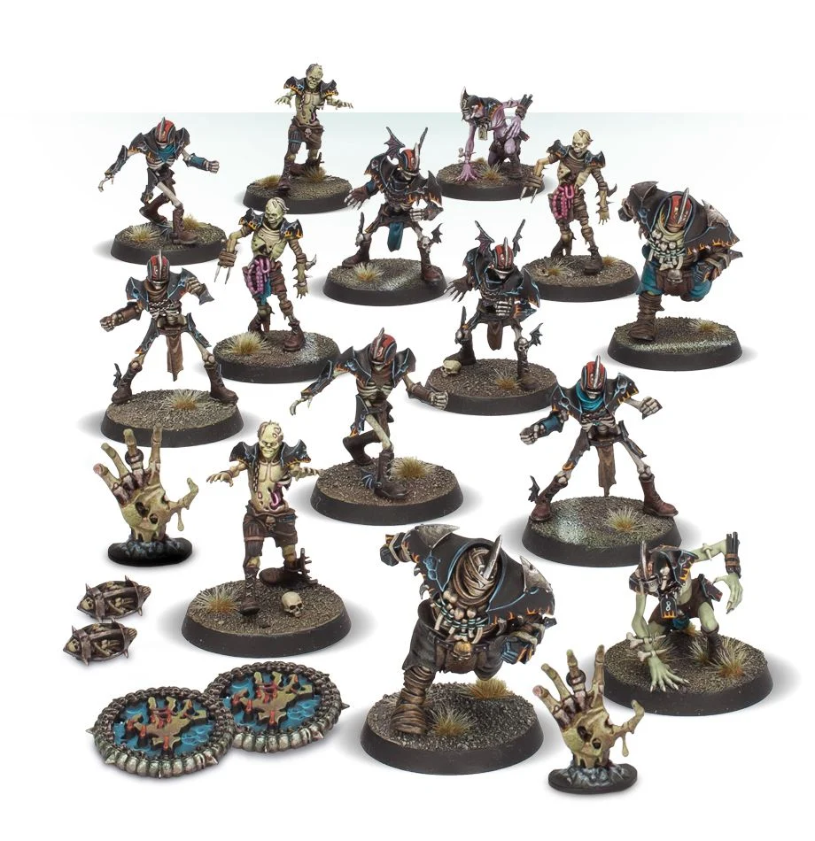

**TIER 1**

### Positionals

| Qty  | Position         | M | S | AG | P  | AR  | Skills                               | Primary | Secondary | Cost |
| ---- | ---------------- | - | - | -- | -- | --- | ------------------------------------ | ------- | --------- | ---- |
| 0-12 | Skeleton Lineman | 5 | 3 | 4+ | 6+ | 8+  | • [Regeneration]   • [Thick Skull]      | G       | A S        | 40K  |
| 0-12 | Zombie Lineman   | 4 | 3 | 4+ | -  | 9+  | • [Regeneration]                         | G       | A S        | 40K  |
| 0-4  | Ghoul Runner     | 7 | 3 | 3+ | 4+ | 8+  | • [Dodge]                              | A G       | P S      | 75K  |
| 0-2  | Wight Blitzer    | 6 | 3 | 3+ | 5+ | 9+  | • [Block]   • [Regeneration]   | G  S      | A P     | 90K  |
| 0-2  | Mummy            | 3 | 5 | 5+ | -  | 10+ | • [Mighty Blow] (+1)   • [Regeneration] | S       | A G       | 125K |

### Special Rules

* [Sylvanian Spotlight]
* [Masters of Undeath]

### Staff

* [Cheerleader] - 10K
* [Assistant Coach] - 10K
* [Re-roll] - 70K

### Starplayers

* [Akhorne The Squirrel]                     
* [Bryce 'The Slice' Cambuel]                
* [Frank 'n' Stein]                          
* [Grak and Crumbleberry]                    
* [Gretchen Wächter 'The Blood Bowl Widow'] 
* [Helmut Wulf]                              
* [Skrull Halfheight]                        
* [Wilhelm Chaney]   

### Inducements

* [Temp Agency Cheerleaders] - 20K
* [Part-time Assistant Coaches] - 20K
* [Weather mage] - 30K
* [Unlimited Mercenary Player] - 30K
* [Bloodweiser Kegs] - 50K
* [Special Plays] - 100K
* [Extra Team Training] - 100K
* [Bribe] - 100K
* [Mortuary Assistant] - 100K
* [Josef Bugman] - 100K
* [Hireling Sports-Wizard] (Wizard) - 150K
* [Mortuary Assistant] (Wizard) - 150K
* [Biased Referee] - 120K
* [Halfling Master Chef] - 300K

### New Inducements

* [Stunty Superstar] (Specialized Mercenary) - 30K
* [Team Mascot] - 30K
* [Legendary Lineman] (Specialized Mercenary) - 50K
* [Brutal Blocker] (Specialized Mercenary) - 50K
* [Medicinal Unguent] - 60K
* [Reliable Ringer] (Specialized Mercenary) - 70K
* [The Trundlefoot Triplets] (Biased Referee) - 80K
* [Schielund Scharlitan] - 90K
* [Ayleen Andar] - 100K
* [Jorm the Ogre] (Biased Referee) - 120K
* [Bona Fide Big Guy] (Specialized Mercenary) - 130K
* [Professor Frönkelheim] - 130K
* [Horatio X. Schottenheim] - 150K
* [Wicked Witch] (Wizard) - 150K
* [Sports Necrotheurge] (Wizard) - 150K
* [Giant Mercenary] - 350K
