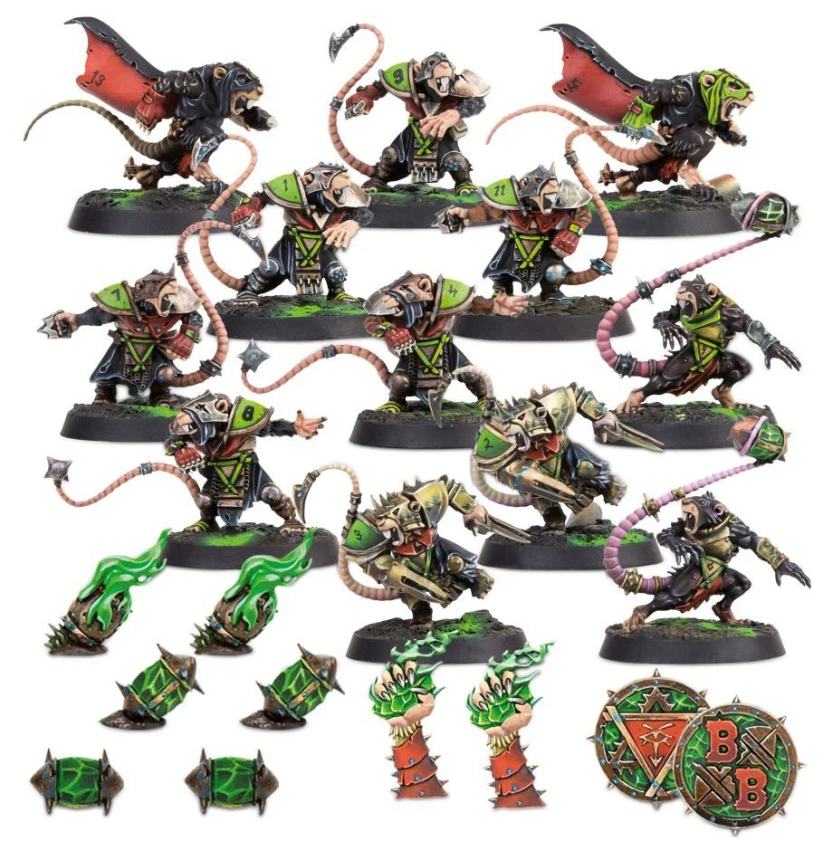

**TIER 1**

### Positionals

| Qty  | Position               | MA | ST | AG | PA | AR | Skills                                                                                                  | Primary | Secondary | Cost |
| ---- | ---------------------- | - | - | -- | - | -- | ------------------------------------------------------------------------------------------------------- | ------- | --------- | ---- |
| 0‑16 | Skaven Clanrat Lineman | 7 | 3 | 3+ | 4+ | 8+  |                                                                                                         | G       | A M S     | 50K  |
| 0‑2  | Thrower                | 7 | 3 | 3+ | 2+ | 8+  | • [Pass]  • [Sure Hands]                                                                              | G P     | A M S     | 85K  |
| 0‑4  | Gutter Runner          | 9 | 2 | 2+ | 4+ | 8+  | • [Dodge]                                                                                                 | A G     | M P S     | 85K  |
| 0‑2  | Blitzer                | 7 | 3 | 3+ | 5+ | 9+  | • [Block]                                                                                                 | G S     | A M P     | 90K  |
| 0‑1  | Rat Ogre               | 6 | 5 | 4+ | - | 9+  | • [Animal Savagery]  • [Frenzy]   • [Loner] (4+)   • [Mighty Blow] (+1)   • [Prehensile Tail] | S       | A G M     | 150K |

### Special Rules

* [Underworld Challenge]

### Staff

* [Cheerleader] - 10K
* [Assistant Coach] - 10K
* [Re-roll] - 50K
* [Apothecary]  - 50K

### Starplayers

* [Akhorne The Squirrel] - 80K
* [Bomber Dribblesnot] - 50K
* [Fungus the Loon] - 80K
* [Glart Smashrip] - 195K
* [Grak and Crumbleberry] - 250K
* [Hakflem Skuttlespike] - 210K
* [Helmut Wulf] - 140K
* [Kreek 'the Verminator' Rustgouger] - 170K
* [Morg 'n' Thorg] - 380K
* [Nobbla Blackwart] - 120K
* [Ripper Bolgrot] - 250K
* [Scrappa Sorehead] - 130K
* [Skitter Stab-Stab] - 150K
* [The Black Gobbo] - 225K
* [Varag Ghoul-Chewer] - 280K

### Inducements

* [Part-time Assistant Coaches] - 20K
* [Temp Agency Cheerleaders] - 20K
* [Unlimited Mercenary Player] - 30K
* [Weather Mage] - 30K
* [Bloodweiser Kegs] - 50K
* [Bribe] - 100K
* [Extra Team Training] - 100K
* [Josef Bugman] - 100K
* [Special Plays] - 100K
* [Wandering Apothecary] - 100K
* [Biased Referee] - 120K
* [Hireling Sports-Wizard] (Wizard) - 150K
* [Halfling Master Chef] - 300K

### New Inducements

* [Stunty Superstar] (Specialized Mercenary) - 30K
* [Team Mascot] - 30K
* [Brutal Blocker] (Specialized Mercenary) - 50K
* [Legendary Lineman] (Specialized Mercenary) - 50K
* [Medicinal Unguent] - 60K
* [Krot Shockwhisker] - 70K
* [Reliable Ringer] (Specialized Mercenary) - 70K
* [Mungo Spinecracker] - 80K
* [Papa Skullbones] - 80K
* [The Trundlefoot Triplets] (Biased Referee) - 80K
* [Fink da Fixer] - 90K
* [Schielund Scharlitan] - 90K
* [Ayleen Andar] - 100K
* [Jorm the Ogre] (Biased Referee) - 120K
* [Bona Fide Big Guy] (Specialized Mercenary) - 130K
* [Horatio X. Schottenheim] - 150K
* [Horticulturalist of Nurgle] (Wizard) - 150K
* [Night Goblin Shaman] (Wizard) - 150K
* [Warlock Engineer] (Wizard) - 150K
* [Wicked Witch] (Wizard) - 150K
* [Giant Mercenary] - 350K
