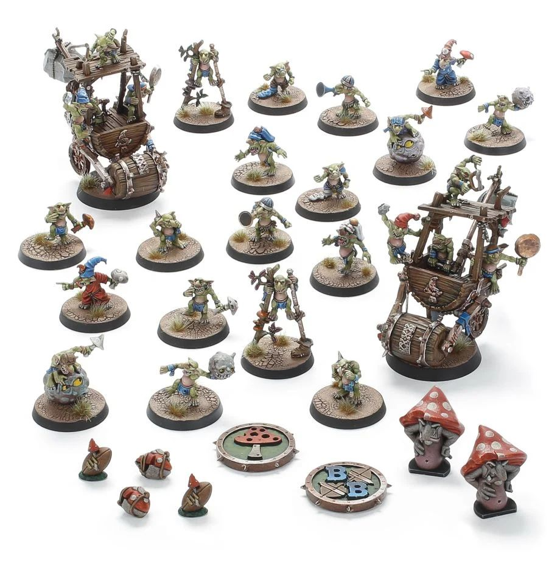

**TIER 3**

### Positionals

| Qty  | Position         | MA | ST | AG | PA  | AR  | Skills                                                                                                                                                       | Primary | Secondary | Cost |
| ---- | ---------------- | - | - | -- | -- | --- | ------------------------------------------------------------------------------------------------------------------------------------------------------------ | ------- | --------- | ---- |
| 0‑16 | Snotling Lineman | 5 | 1 | 3+ | 5+ | 6+  | • [Dodge]  • [Right Stuff]   • [Sidestep]   • [Stunty]   • [Swarming]   • [Titchy]                                                               | A       | G         | 15K  |
| 0‑2  | Fungus Flinga    | 5 | 1 | 3+ | 4+ | 6+  | • [Bombardier]  • [Dodge]   • [Right Stuff]   • [Secret Weapon]   • [Sidestep]   • [Stunty]                                                        | A P     | G         | 30K  |
| 0‑2  | Fun-Hoppa        | 6 | 1 | 3+ | 5+ | 6+  | • [Dodge]  • [Pogo Stick]   • [Right Stuff]   • [Sidestep]   • [Stunty]                                                                             | A       | G         | 20K  |
| 0‑2  | Stilty Runna     | 6 | 1 | 3+ | 5+ | 6+  | • [Dodge]  • [Right Stuff]   • [Sidestep]   • [Sprint]   • [Stunty]                                                                               | A       | G         | 20K  |
| 0‑2  | Pump Wagon       | 4 | 5 | 5+ | -  | 9+  | • [Dirty Player] (+1)  • [Juggernaut]   • [Mighty Blow] (+1)   • [Really Stupid]   • [Secret Weapon]   • [Stand Firm]                                 | S       | A G       | 105K |
| 0‑2  | Trained Troll    | 4 | 5 | 5+ | 5+ | 10+ | • [Always Hungry]  • [Loner] (3+)   • [Mighty Blow] (+1)   • [Projectile Vomit]   • [Really Stupid]   • [Regeneration]   • [Throw Team-mate] | S       | A G P     | 115K |

### Special Rules

* [Badlands Brawl]
* [Bribery and Corruption]
* [Underworld Challenge]
* [Low Cost Linemen]

### Staff

* [Cheerleader] - 10K
* [Assistant Coach] - 10K
* [Re-roll] - 60K
* [Apothecary]  - 50K

### Starplayers

* [Akhorne The Squirrel] - 80K
* [Bomber Dribblesnot] - 50K
* [Fungus the Loon] - 80K
* [Glart Smashrip] - 195K
* [Grak and Crumbleberry] - 250K
* [Hakflem Skuttlespike] - 210K
* [Helmut Wulf] - 140K
* [Kreek 'the Verminator' Rustgouger] - 170K
* [Morg 'n' Thorg] - 380K
* [Nobbla Blackwart] - 120K
* [Ripper Bolgrot] - 250K
* [Scrappa Sorehead] - 130K
* [Skitter Stab-Stab] - 150K
* [The Black Gobbo] - 225K
* [Varag Ghoul-Chewer] - 280K

### Inducements

* [Part-time Assistant Coaches] - 20K
* [Temp Agency Cheerleaders] - 20K
* [Unlimited Mercenary Player] - 30K
* [Weather Mage] - 30K
* [Bloodweiser Kegs] - 50K
* [Bribe] - 50K
* [Biased Referee] - 80K
* [Extra Team Training] - 100K
* [Josef Bugman] - 100K
* [Riotous Rookies] - 100K
* [Special Plays] - 100K
* [Wandering Apothecary] - 100K
* [Hireling Sports-Wizard] (Wizard) - 150K

### New Inducements

* [Stunty Superstar] (Specialized Mercenary) - 30K
* [Team Mascot] - 30K
* [Bottles of Heady Brew] - 40K
* [Brutal Blocker] (Specialized Mercenary) - 50K
* [Legendary Lineman] (Specialized Mercenary) - 50K
* [Waaagh! Drummer] - 50K
* [Medicinal Unguent] - 60K
* [Krot Shockwhisker] - 70K
* [Reliable Ringer] (Specialized Mercenary) - 70K
* [Jorm the Ogre] (Biased Referee) - 80K
* [Mungo Spinecracker] - 80K
* [Papa Skullbones] - 80K
* [The Trundlefoot Triplets] (Biased Referee) - 80K
* [Fink da Fixer] - 90K
* [Schielund Scharlitan] - 90K
* [Ayleen Andar] - 100K
* [Bona Fide Big Guy] (Specialized Mercenary) - 130K
* [Night Goblin Shaman] (Wizard) - 150K
* [Ogre Firebelly] (Wizard) - 150K
* [Wicked Witch] (Wizard) - 150K
* [Warlock Engineer] (Wizard) - 150K
* [Horticulturalist of Nurgle] (Wizard) - 150K
