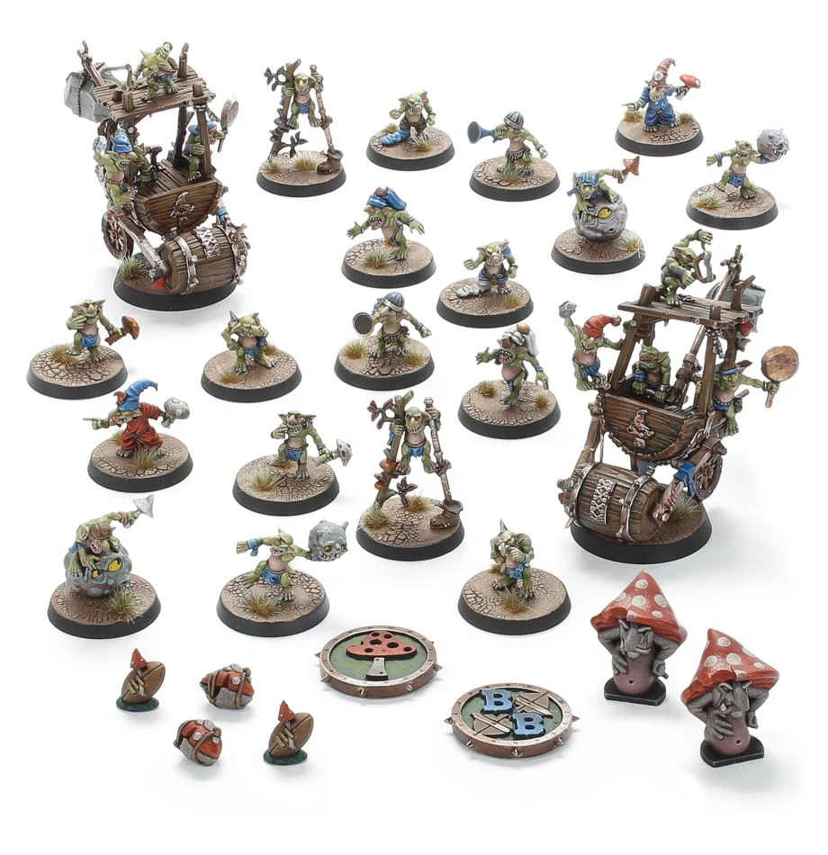

**TIER 3**

### Positionals

| Qty  | Position         | M | S | AG | P  | AR  | Skills                                                                                                                                                       | Primary | Secondary | Cost |
| ---- | ---------------- | - | - | -- | -- | --- | ------------------------------------------------------------------------------------------------------------------------------------------------------------ | ------- | --------- | ---- |
| 0-16 | Snotling Lineman | 5 | 1 | 3+ | 5+ | 6+  | • [Dodge]  • [Right Stuff]   • [Side Step]   • [Stunty]   • [Swarming]   • [Titchy]                                                               | A       | G         | 15K  |
| 0-2  | Fungus Flinga    | 5 | 1 | 3+ | 4+ | 6+  | • [Bombardier]  • [Dodge]   • [Right Stuff]   • [Secret Weapon]   • [Side Step]   • [Stunty]                                                        | A P     | G         | 30K  |
| 0-2  | Fun-Hoppa        | 6 | 1 | 3+ | 5+ | 6+  | • [Dodge]  • [Pogo Stick]   • [Right Stuff]   • [Side Step]   • [Stunty]                                                                             | A       | G         | 20K  |
| 0-2  | Stilty Runna     | 6 | 1 | 3+ | 5+ | 6+  | • [Dodge]  • [Right Stuff]   • [Side Step]   • [Sprint]   • [Stunty]                                                                               | A       | G         | 20K  |
| 0-2  | Pump Wagon       | 4 | 5 | 5+ | -  | 9+  | • [Dirty Player] (+1)  • [Juggernaut]   • [Mighty Blow] (+1)   • [Really Stupid]   • [Secret Weapon]   • [Stand Firm]                                 | S       | A G       | 105K |
| 0-2  | Trained Troll    | 4 | 5 | 5+ | 5+ | 10+ | • [Always Hungry]  • [Loner] (3+)   • [Mighty Blow] (+1)   • [Projectile Vomit]   • [Really Stupid]   • [Regeneration]   • [Throw Team-mate] | S       | A G P     | 115K |

### Special Rules

Badlands Brawl
Bribery and Corruption
Underworld Challenge
Low Cost Linemen

### Staff

* [Cheerleader] - 10K
* [Assistant Coach] - 10K
* [Re-roll] - 60K
* [Apothecary]  - 50K

### Starplayers

* [Bomber Dribblesnot]
* [Akhorne The Squirrel]
* [Fungus the Loon]
* [Nobbla Blackwart]
* [Scrappa Sorehead]
* [Helmut Wulf]
* [Kreek Rustgouger]
* [Glart Smashrip]
* [Hakflem Skuttlespike]
* [The Black Gobbo]
* [Grak and Crumbleberry]
* [Ripper Blogrot]
* [Varag Ghoul-Chewer]
* [Morg'n Thorg]

### Inducements

* [Temp Agency Cheerleaders] - 20K
* [Part-time Assistant Coaches] - 20K
* [Weather Mage] - 30K
* [Minus superstar] (Specialized Mercenary) - 30K
* [Team Mascot] - 30K
* [Unlimited Mercenary Player] - 30K
* [Bottles of Heady Brew] - 40K
* [Bloodweiser Kegs] - 50K
* [Bribe] - 50K
* [Legendary Lineman] (Specialized Mercenary) - 50K
* [Brutal Blocker] (Specialized Mercenary) - 50K
* [Waaagh]! Drummer - 50K
* [Medicinal Unguent] - 60K
* [Safe Provider] (Specialized Mercenary) - 70K
* [Krot Shockwisker] - 70K
* [Biased Referee] - 80K
* [Mungo Spinecracker] - 80K
* [Jorm the Ogre] (Biased Referee) - 80K
* [The Trundlefoot Triplets] (Biased Referee) - 80K
* [Papa Skullbones] - 80K
* [Fink da Fixer] - 90K
* [Schielund Scharlitan] - 90K
* [Ogres Firebelly] (Wizard) - 150K
* [Hireling Sports-Wizard] (Wizard) - 150K
* [Night Goblin Shaman] (Wizard) - 150K
* [Wicked Witch] (Wizard) - 150K
