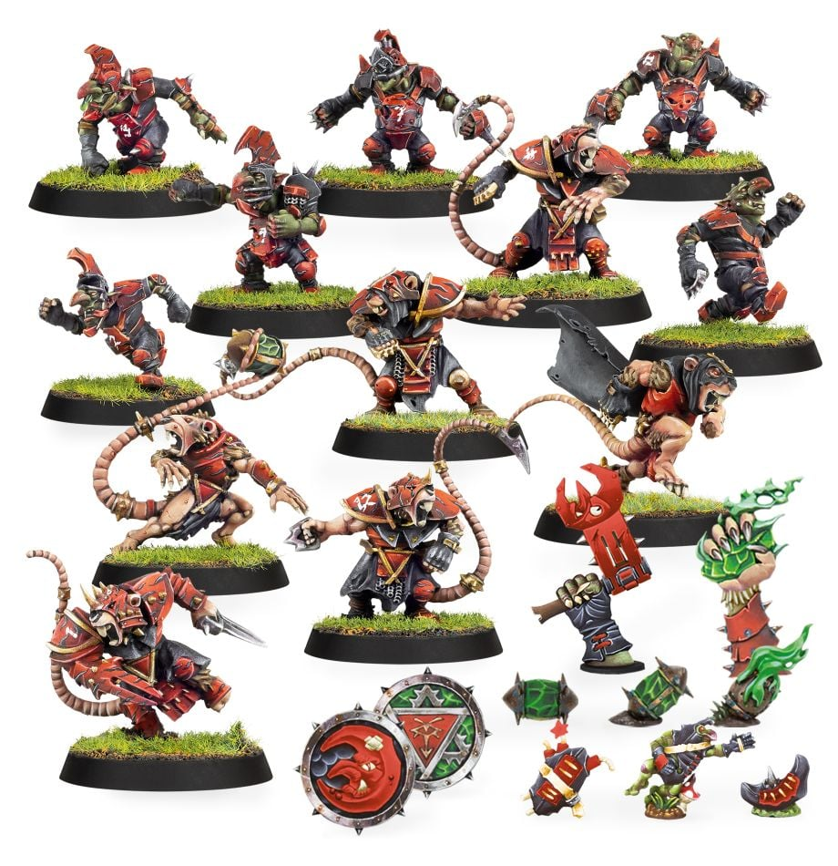

**TIER 1**

### Positionals

| Qty  | Position                  | M | S | AG | P  | AR  | Skills                                                                                                                                                       | Primary | Secondary | Cost |
| ---- | ------------------------- | - | - | -- | -- | --- | ------------------------------------------------------------------------------------------------------------------------------------------------------------ | ------- | --------- | ---- |
| 0-12 | Underworld Goblin Lineman | 6 | 2 | 3+ | 4+ | 8+  | [Dodge]  [Right Stuff]   [Stunty]                                                                                                                  | A M     | G S       | 40K  |
| 0-6  | Underworld Snotling       | 5 | 1 | 3+ | 5+ | 6+  | [Dodge]  [Right Stuff]   [Side Step]   [Stunty]   Swarming                                                                               | A M     | G         | 15K  |
| 0-3  | Skaven Clanrat            | 7 | 3 | 3+ | 4+ | 8+  | [Animosity] (Underworld Goblin Linemen)                                                                                                                      | G M     | A S       | 50K  |
| 0-1  | Skaven Thrower            | 7 | 3 | 3+ | 2+ | 8+  | [Animosity] (Underworld Goblin Linemen)  [Pass]   [Sure Hands]                                                                                     | G M P  | A S       | 85K  |
| 0-1  | Gutter Runner             | 9 | 2 | 2+ | 4+ | 8+  | [Animosity] (Underworld Goblin Linemen)  [Dodge]                                                                                                        | A G M  | P S       | 85K  |
| 0-1  | Skaven Blitzer            | 7 | 3 | 3+ | 5+ | 9+  | [Animosity] (Underworld Goblin Linemen)  [Block]                                                                                                        | G M S  | A P       | 90K  |
| 0-1  | Underworld Troll\*        | 4 | 5 | 5+ | 5+ | 10+ | [Always Hungry]  [Loner] (4+)   [Mighty Blow] (+1)   [Projectile Vomit]   [Really Stupid]   [Regeneration]   [Throw Team-mate] | M S    | A G P     | 115K |
| 0-1  | Mutant Rat Ogre\*         | 6 | 5 | 4+ | -  | 9+  | [Animal Savagery]  [Frenzy]   [Loner] (4+)   [Mighty Blow] (+1)   [Prehensile Tail]                                                      | M S    | A G       | 150K |

\* An Underworld team may include a single Big Guy.

### Special Rules

Bribery and Corruption
Underworld Challenge

### Staff

* [Cheerleader] - 10K
* [Assistant Coach] - 10K
* [Reroll] - 70K
* [Apothecary]  - 50K

### Starplayers

* [Bomber Dribblesnot]
* [Akhorne The Squirrel]
* [Fungus the Loon]
* [Nobbla Blackwart]
* [Scrappa Sorehead]
* [Helmut Wulf]
* [Kreek Rustgouger]
* [Glart Smashrip]
* [Hakflem Skuttlespike]
* [The Black Gobbo]
* [Grak and Crumbleberry]
* [Ripper Blogrot]
* [Varag Ghoul-Chewer]
* [Morg'n Thorg]

### Inducements

* [Temp Agency Cheerleaders] - 20K
* [Part-time Assistant Coaches] - 20K
* [Weather Mage] - 30K
* [Minus superstar] (Specialized Mercenary) - 30K
* [Team Mascot] - 30K
* [Unlimited Mercenary Player] - 30K
* [Bloodweiser Kegs] - 50K
* [Bribe] - 50K
* [Legendary Lineman] (Specialized Mercenary) - 50K
* [Brutal Blocker] (Specialized Mercenary) - 50K
* [Medicinal Unguent] - 60K
* [Safe Provider] (Specialized Mercenary) - 70K
* [Krot Shockwisker] - 70K
* [Biased Referee] - 80K
* [Mungo Spinecracker] - 80K
* [Jorm the Ogre] (Biased Referee) - 80K
* [The Trundlefoot Triplets] (Biased Referee) - 80K
* [Papa Skullbones] - 80K
* [Fink da Fixer] - 90K
* [Schielund Scharlitan] - 90K
* [Guaranteed Big Guy] (Specialized Mercenary) - 130K
* [Hireling Sports-Wizard] (Wizard) - 150K
* [Night Goblin Shaman] (Wizard) - 150K
* [Wicked Witch] (Wizard) - 150K
* [Warlock Engineer] (Wizard) - 150K
