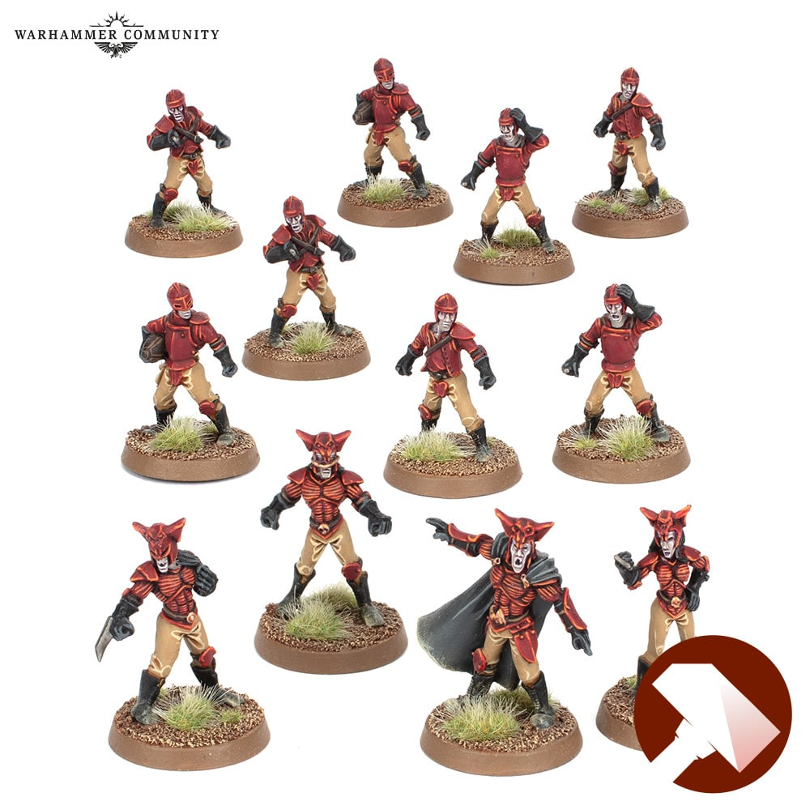

**TIER 2**

### Positionals

| Qty  | Position        | M | S | AG | P  | AR | Skills                                                   | Primary | Secondary | Cost |
| ---- | --------------- | - | - | -- | -- | -- | -------------------------------------------------------- | ------- | --------- | ---- |
| 0-16 | Thrall Lineman  | 6 | 3 | 3+ | 5+ | 8+ |                                                          | G       | A S       | 40K  |
| 0-6  | Vampire Blitzer | 6 | 4 | 2+ | 3+ | 9+ | [Animal Savagery]   Hypnotic Gaze   [Regeneration] | G       | A S P     | 110K |

### Special Rules

Sylvanian Spotlight

### Staff

* [Cheerleader] - 10K
* [Assistant Coach] - 10K
* [Reroll] - 70K
* [Apothecary]  - 50K

### Starplayers

* [Akhorne The Squirrel]                     
* [Bryce 'The Slice' Cambuel]                
* [Helmut Wulf]                              
* [Skrull Halfheight]                        
* [Wilhelm Chaney]                           
* [Grak and Crumbleberry]                      
* [Frank 'n' Stein]                          
* [Gretchen Wächter 'The Blood Bowl Widow'] 

### Inducements

* [Temp Agency Cheerleaders] - 20K
* [Part-time Assistant Coaches] - 20K
* [Weather Mage] - 30K
* [Minus superstar] (Specialized Mercenary) - 30K
* [Team Mascot] - 30K
* [No Limit Mercenary] - 30K
* [Bloodweiser Kegs] - 50K
* [Legendary Lineman] (Specialized Mercenary) - 50K
* [Brutal Blocker] (Specialized Mercenary) - 50K
* [Medicinal Unguent] - 60K
* [Safe Provider] (Specialized Mercenary) - 70K
* [The Trundlefoot Triplets] (Biased Referee) - 80K
* [Schielund Scharlitan] - 90K
* [Ayleen Andar] - 100K
* [Special Plays] - 100K
* [Extra Training] - 100K
* [Bribe] - 100K
* [Wandering Apothecary] - 100K
* [Mortuary Assistant] - 100K
* [Josef Bugman] - 100K
* [Biased Referee] - 120K
* [Jorm the Ogre] (Biased Referee) - 120K
* [Guaranteed Big Guy] (Specialized Mercenary) - 130K
* [Professor Frönkelheim] - 130K
* [Hireling Sports-Wizard] (Wizard) - 150K
* [Wicked Witch] (Wizard) - 150K
* [Sports Necrotheurge] (Wizard) - 150K
* [Halfling Master Chef] - 300K
* [Mercenary Giant] - 350K
