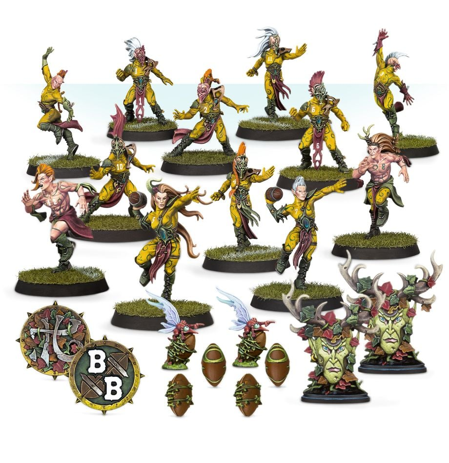

**TIER 1**

### Positionals

| Qty  | Position             | MA | ST | AG | PA  | AR  | Skills                                                                                                                                     | Primary | Secondary | Cost |
| ---- | -------------------- | - | - | -- | -- | --- | ------------------------------------------------------------------------------------------------------------------------------------------ | ------- | --------- | ---- |
| 0‑12 | Wood Elf Lineman     | 7 | 3 | 2+ | 4+ | 8+  |                                                                                                                                            | A G     | S         | 70K  |
| 0‑2  | Thrower              | 7 | 3 | 2+ | 2+ | 8+  | • [Pass]                                                                                                                                     | A G P   | S         | 95K  |
| 0‑4  | Catcher              | 8 | 2 | 2+ | 4+ | 8+  | • [Catch]  • [Dodge]                                                                                                                      | A G     | P S       | 90K  |
| 0‑2  | Wardancer            | 8 | 3 | 2+ | 4+ | 8+  | • [Block]  • [Dodge]   • [Leap]                                                                                                        | A G     | P S       | 125K |
| 0‑1  | Loren Forest Treeman | 2 | 6 | 5+ | 5+ | 11+ | • [Loner] (4+)  • [Mighty Blow] (+1)   • [Stand Firm]   • [Strong Arm]   • [Take Root]   • [Thick Skull]   • [Throw Team-mate] | S       | A G       | 120K |

### Special Rules

* [Elven Kingdoms League]

### Staff

* [Cheerleader] - 10K
* [Assistant Coach] - 10K
* [Re-roll] - 50K
* [Apothecary]  - 50K

### Starplayers

* [Akhorne The Squirrel] - 80K
* [Eldril Sidewinder] - 230K
* [Gloriel Summerbloom] - 150K
* [Grak and Crumbleberry] - 250K
* [Helmut Wulf] - 140K
* [Jeremiah Kool] - 320K
* [Jordell Freshbreeze] - 250K
* [Kiroth Krakeneye] - 160K
* [Maple Highgrove] - 210K
* [Morg 'n' Thorg] - 380K
* [Roxanna Darknail] - 270K
* [Swiftvine Glimmershard] - 110K
* [The Swift Twins] - 340K
* [Willow Rosebark] - 150K
* [Zolcath the Zoat] - 230K

### Inducements

* [Temp Agency Cheerleaders] - 20K
* [Part-time Assistant Coaches] - 20K
* [Weather Mage] - 30K
* [Unlimited Mercenary Player] - 30K
* [Bloodweiser Kegs] - 50K
* [Special Plays] - 100K
* [Extra Team Training] - 100K
* [Bribe] - 100K
* [Wandering Apothecary] - 100K
* [Josef Bugman] - 100K
* [Biased Referee] - 120K
* [Hireling Sports-Wizard] (Wizard) - 150K
* [Halfling Master Chef] - 300K

### New Inducements

* [Stunty Superstar] (Specialized Mercenary) - 30K
* [Team Mascot] - 30K
* [Galandril Silverwater] - 40K
* [Legendary Lineman] (Specialized Mercenary) - 50K
* [Kari Coldsteel] - 50K
* [Medicinal Unguent] - 60K
* [Brutal Blocker] (Specialized Mercenary) - 70K
* [Reliable Ringer] (Specialized Mercenary) - 70K
* [Horatio X. Schottenheim] - 80K
* [The Trundlefoot Triplets] (Biased Referee) - 80K
* [Schielund Scharlitan] - 90K
* [Ayleen Andar] - 100K
* [Jorm the Ogre] (Biased Referee) - 120K
* [Bona Fide Big Guy] (Specialized Mercenary) - 130K
* [Asur High Mage] (Wizard) - 150K
* [Druchii Sports Sorceress] (Wizard) - 150K
* [Giant Mercenary] - 350K
