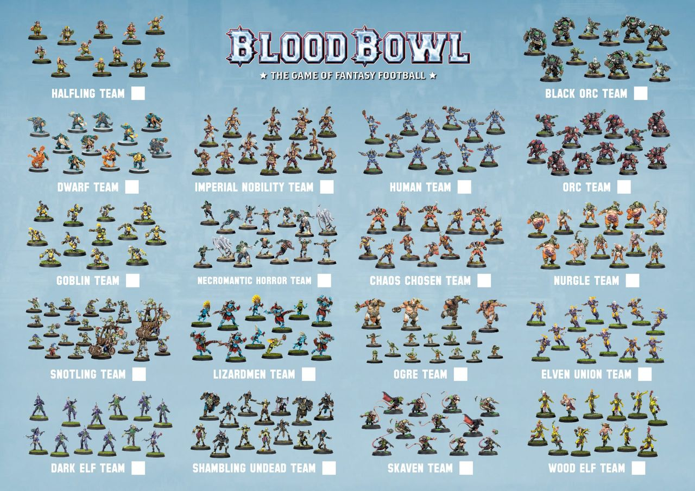

From diminutive Halflings to huge hulking ogres, from elegant and graceful Elves to lumbering and brutal orcs - Blood Bowl players come in all shapes and sizes. These players represent A Great many races and nations from all over the known world, which form up into an even greater number of teams of differrent types. From fresh-faced rookie squads, to famous franchises established decades ago, the number of teams playing the game today is higher than at any time in history. Teams travel far and wide searching for fame and glory. Some will make it. Most will be forgotten, a footnote on the sports trivia encyclopaedias of history.

